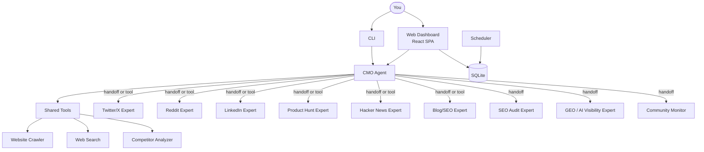

<div align="center">
  
</div>

<h1 align="center">OpenCMO</h1>

<p align="center">
  <strong>Open-source AI CMO — your full marketing team in one tool.</strong><br/>
  <sub>Multi-agent system with 10 expert agents, real-time monitoring, and a modern web dashboard.</sub>
</p>

<div align="center">
  <a href="README.md">🇺🇸 English</a> | <a href="README_zh.md">🇨🇳 中文</a> | <a href="README_ja.md">🇯🇵 日本語</a> | <a href="README_ko.md">🇰🇷 한국어</a> | <a href="README_es.md">🇪🇸 Español</a>
</div>

<div align="center">
  <a href="https://www.python.org/downloads/"></a>
  <a href="LICENSE"></a>
  <a href="https://github.com/study8677/OpenCMO/stargazers"></a>
</div>

---

## Screenshots

<div align="center">
  
  <br/><sub>Project dashboard with SEO, GEO, Community & SERP scores</sub>
</div>
<br/>
<div align="center">
  
  <br/><sub>Chat with 10 AI experts — pick one or let CMO auto-route</sub>
</div>
<br/>
<div align="center">
  
  <br/><sub>Multi-agent strategy discussion: 3 roles × 3 rounds → keywords & monitoring plan</sub>
</div>

---

## What is OpenCMO?

OpenCMO is a **multi-agent AI marketing system** for indie developers and small teams. Enter a URL — the system crawls your site, runs a multi-agent strategy discussion, and automatically sets up monitoring for SEO, AI visibility, and community discussions.

### Key Capabilities

- **10 AI Expert Agents** — Twitter/X, Reddit, LinkedIn, Product Hunt, Hacker News, Blog/SEO, SEO Audit, GEO (AI Visibility), Community Monitor, and the CMO orchestrator
- **Smart URL Analysis** — Paste any URL; 3 AI roles (Product Analyst, SEO Specialist, Community Strategist) debate 3 rounds to extract brand name, category, and monitoring keywords
- **Real-time Web Dashboard** — React SPA with dark sidebar, project cards, trend charts, i18n (EN/中文)
- **Chat with Experts** — ChatGPT-style interface with conversation history; pick a specific agent or let CMO auto-route
- **Continuous Monitoring** — Cron-based scheduled scans for SEO, GEO, and community metrics
- **Any LLM Provider** — OpenAI, NVIDIA NIM, DeepSeek, Ollama, or any OpenAI-compatible API

## Architecture



## Quick Start

### 1. Install

```bash
git clone https://github.com/study8677/OpenCMO.git
cd OpenCMO
pip install -e ".[all]"
crawl4ai-setup
```

### 2. Configure

```bash
cp .env.example .env
# Edit .env — set your API key:
#   OPENAI_API_KEY=sk-...          (OpenAI)
#   or NVIDIA NIM / DeepSeek / Ollama — see .env.example for examples
```

### 3. Run

```bash
# Web dashboard (recommended)
opencmo-web                # → http://localhost:8080/app

# CLI mode
opencmo                    # Interactive terminal
```

### 4. Use

1. Go to **Monitors** → paste a URL → click **Start Monitoring**
2. Watch the AI multi-agent discussion analyze your product in real-time
3. System auto-extracts brand name, category, and keywords
4. Full scan runs automatically (SEO + GEO + Community)
5. View results in **Dashboard** → click your project

## Features

### 🤖 10 AI Expert Agents

| Agent | What it does |
|-------|-------------|
| **CMO Agent** | Orchestrates everything, auto-routes to the right expert |
| **Twitter/X** | Tweets, threads & engagement hooks |
| **Reddit** | Authentic story-driven posts for niche subreddits |
| **LinkedIn** | Professional thought-leadership posts |
| **Product Hunt** | Launch taglines, descriptions & maker comments |
| **Hacker News** | Technical Show HN posts |
| **Blog/SEO** | SEO-optimized articles (2000+ words) |
| **SEO Audit** | Core Web Vitals, Schema.org, robots/sitemap analysis |
| **GEO (AI Visibility)** | Brand mentions across Perplexity, You.com, ChatGPT, Claude, Gemini |
| **Community Monitor** | Scans Reddit, HN, Dev.to for discussions |

### 📊 Monitoring & Analytics

- **SEO** — Performance score, LCP/CLS/TBT, Schema.org detection, robots.txt & sitemap checks
- **GEO** — AI search visibility score (0-100) across 5 platforms
- **SERP** — Keyword ranking tracking on Google
- **Community** — Discussion counts, engagement scores, platform distribution

### 🎯 Smart URL Analysis (Multi-Agent Discussion)

When you add a URL, 3 AI roles hold a 3-round discussion:

| Round | What happens |
|-------|-------------|
| **Round 1** | Each role gives initial analysis (product positioning, SEO keywords, community topics) |
| **Round 2** | Roles build on each other's insights, refine keyword suggestions |
| **Round 3** | Strategy Director synthesizes final brand name + category + 5-8 monitoring keywords |

### 🌐 Web Dashboard

- Dark sidebar, modern card layout
- i18n support (English / 中文)
- Chat with conversation history (SQLite-persisted)
- Agent selection grid — click to chat with any expert
- Settings dialog for API key configuration
- Real-time analysis progress dialog

### 🔧 Flexible Configuration

```bash
# OpenAI (default)
OPENAI_API_KEY=sk-...

# NVIDIA NIM
OPENAI_API_KEY=nvapi-...
OPENAI_BASE_URL=https://integrate.api.nvidia.com/v1
OPENCMO_MODEL_DEFAULT=moonshotai/kimi-k2.5

# DeepSeek
OPENAI_API_KEY=sk-...
OPENAI_BASE_URL=https://api.deepseek.com/v1
OPENCMO_MODEL_DEFAULT=deepseek-chat

# Local Ollama
OPENAI_API_KEY=ollama
OPENAI_BASE_URL=http://localhost:11434/v1
OPENCMO_MODEL_DEFAULT=llama3
```

## CLI Commands

```
opencmo                                    # Interactive chat
opencmo-web                                # Web dashboard

/monitor add <brand> <url> <category>      # Add monitoring
/monitor list                              # List monitors
/monitor run <id>                          # Run scan now
/status                                    # All project statuses
/web                                       # Start web server
```

## Roadmap

- [x] 10 expert agents with multi-channel orchestration
- [x] Multi-agent URL analysis (3 roles × 3 rounds)
- [x] React SPA dashboard with dark theme
- [x] Chat with agent selection & conversation history
- [x] SEO audit, GEO score, SERP tracking, community monitoring
- [x] i18n (English / 中文)
- [x] Settings UI for API key management
- [x] Multi-provider support (OpenAI, NVIDIA, DeepSeek, Ollama)
- [ ] Auto-publish to platforms
- [ ] Full-site SEO crawl
- [ ] Custom brand voice training

## Contributing

Contributions welcome! Fork, branch, PR.

## License

Apache License 2.0 — see [LICENSE](LICENSE).

---

<div align="center">
  <sub>If OpenCMO helps you, a ⭐ would mean a lot!</sub>
</div>
