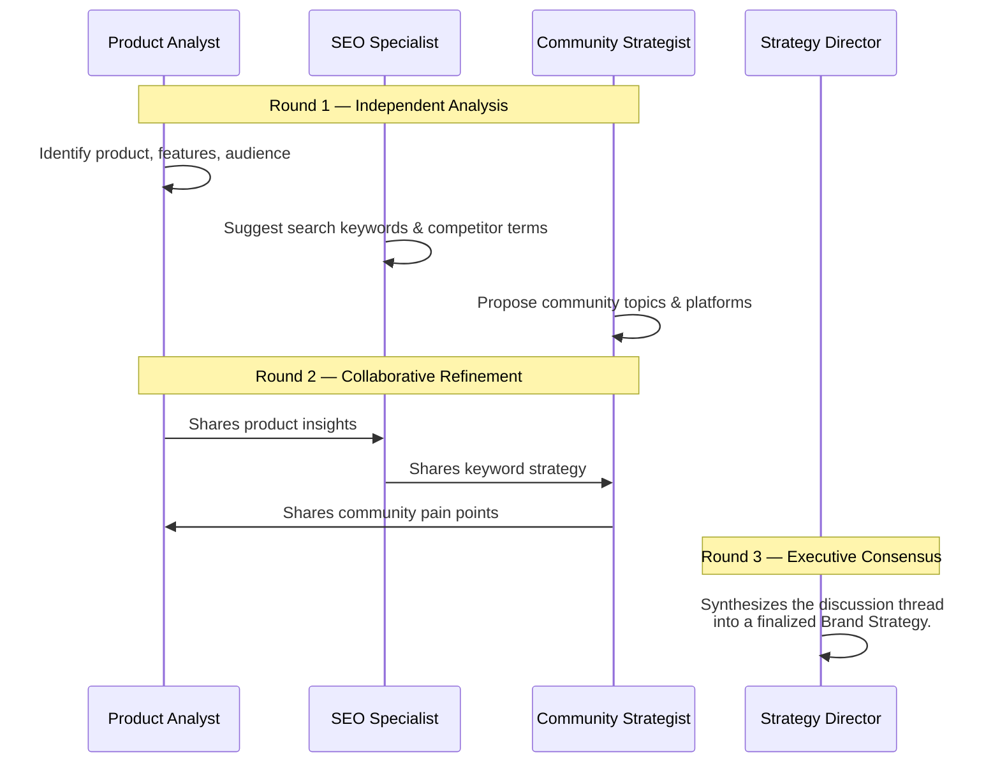

<div align="center">
  
</div>

<h1 align="center">OpenCMO</h1>

<p align="center">
  <strong>The Open-Source AI Chief Marketing Officer — Your Full Marketing Team in One Tool.</strong><br/>
  <sub>A powerful multi-agent system featuring 25+ specialized AI experts, always-on SEO/GEO/SERP/Community monitoring, an exact-payload approval queue, and a modern web dashboard with an interactive 3D knowledge graph.</sub>
</p>

<div align="center">
  <a href="README.md">English</a> | <a href="README_zh.md">中文</a> | <a href="README_ja.md">日本語</a> | <a href="README_ko.md">한국어</a> | <a href="README_es.md">Español</a>
</div>

<p align="center">
  <a href="https://www.python.org/downloads/"></a>
  <a href="LICENSE"></a>
  <a href="https://github.com/study8677/OpenCMO/stargazers"></a>
  
</p>

---

## What is OpenCMO?

OpenCMO is a **multi-agent AI marketing ecosystem** tailored for indie hackers, startups, and small teams. Simply provide your product's URL, and OpenCMO will:

1. **Analyze your website** deeply to understand your product and audience.
2. **Orchestrate a multi-agent strategy debate** to identify the best keywords, positioning, and target communities.
3. **Automate continuous monitoring** across SEO, AI search visibility (GEO), SERP keyword rankings, and developer communities (Reddit, Hacker News, Dev.to).
4. **Generate platform-specific content** for 20+ platforms, review exact publish payloads in an approval queue, and auto-publish to Reddit and Twitter when you explicitly allow it.

---

## Why OpenCMO Hits Different

- **It closes the loop between generation and measurement** — content agents, SEO/GEO/SERP/community monitors, and the 3D graph all feed the same operating surface instead of living in separate tools.
- **Scheduled monitoring now runs inside the web app lifecycle** — when `opencmo-web` is up, saved cron monitors stay active without extra CLI babysitting.
- **Approvals are durable, not disposable previews** — the approval queue stores the exact publish payload before execution, so the reviewed artifact is the one that gets shipped.
- **It stays BYOK and hackable** — storage, APIs, scheduler behavior, and the React SPA remain easy to inspect and extend for your own workflow.

---

## Interface & Experience

A modern React SPA with glassmorphic design, built for maximum clarity and control.

<div align="center">
  
  <p><i>Real-time Project Dashboard — Track your SEO, GEO (AI Visibility), SERP rankings, and Community Engagement at a glance.</i></p>
</div>

<div align="center">
  <h3>
    <a href="https://www.bilibili.com/video/BV1T5AMzoEKV/">
      ▶ Watch the full demo video on Bilibili
    </a>
  </h3>
  <sub>10-minute walkthrough covering all features: SEO Audit, GEO Detection, SERP Tracking, Knowledge Graph, Multi-Agent Chat, and more.</sub>
</div>

---

## Interactive Knowledge Graph

The **Knowledge Graph** is the heart of your market intelligence — an interactive 3D force-directed network that visualizes your entire marketing ecosystem.

<div align="center">
  
  <p><i>A dynamic, 3D force-directed map of your brand, keywords, discussions, competitors, and SERP rankings.</i></p>
</div>

**Key capabilities:**
- **Active graph expansion** — Click "Start Exploring" and the graph autonomously discovers new competitors, keywords, and connections wave by wave. Pause and resume at any time.
- **BFS depth topology** — Discovered nodes link to their parent (not flattened to brand), preserving the exploration tree. Deeper nodes appear smaller and more transparent.
- **Frontier visualization** — Unexplored nodes are highlighted with a purple wireframe ring, showing where the graph can expand next.
- **Interactive exploration** — Zoom, drag, and pan across your brand's digital universe.
- **6 node dimensions** — Brand (purple), Keywords (cyan), Community Discussions (amber), SERP Rankings (green), Competitors (red), Overlapping Keywords (orange).
- **Competitor intelligence** — Add competitor URLs to visualize shared battlegrounds with red dashed connection lines.
- **Real-time sync** — Graph re-balances every 30 seconds (5 seconds during active expansion).
- **AI-powered competitor discovery** — Automatically identify competitors and track overlapping keywords.

---

## Feature Highlights

### SEO Audit

Continuously audit performance scores, Core Web Vitals (LCP, CLS, TBT), Schema.org, robots.txt, and sitemaps via the Google PageSpeed Insights API. The redesigned dashboard features **4 KPI summary cards** with trend arrows and threshold-based status indicators, a **gradient-filled area chart** with Good/Needs Work reference zones, and **3 individual CWV mini-charts** each with their own threshold lines.

<div align="center">
  
  <p><i>KPI cards with trend deltas, performance area chart with threshold zones, and individual CWV trend charts.</i></p>
</div>

### GEO Detection (AI Search Visibility)

Monitor your brand's visibility across AI search engines: Perplexity, You.com, ChatGPT, Claude, and Gemini. The GEO dashboard includes **4 emerald-themed KPI cards**, a **multi-series area chart** with target reference lines, and a **visual snapshot** with color-coded progress bars for each metric.

<div align="center">
  
  <p><i>GEO score KPI cards, multi-series area chart with target line, and latest snapshot progress bars.</i></p>
</div>

### SERP Tracking

Continuously track your target keywords' search positions. Supports web crawling or the DataForSEO API. Features **indigo-themed KPI cards** (keywords tracked, average position, Top 3/Top 10 counts), a **position distribution stacked bar** with color-coded buckets (Top 3 green, 4-10 blue, 11-20 amber, 20+ red), and an **enhanced keyword list** with colored left-border indicators and position badges.

<div align="center">
  
  <p><i>Position distribution bar, color-coded keyword list, and ranking history with Top 3/Top 10 reference zones.</i></p>
</div>

### Community Monitoring

Automatically scan for brand mentions and relevant discussions across **Reddit, Hacker News, Dev.to, YouTube, Bluesky, and Twitter/X**. Features multi-signal scoring (engagement velocity, text relevance, temporal recency, cross-platform convergence detection) for cross-platform comparable rankings. The redesigned dashboard adds **amber-themed KPI cards**, a **two-column chart layout** (hits trend area chart + platform breakdown horizontal bar chart), and an **enhanced discussion list** with color-coded platform badges and engagement mini-bars.

<div align="center">
  
  <p><i>KPI summary, platform breakdown chart, and discussion feed with engagement indicators.</i></p>
</div>

### Trend Research

Research any topic across community platforms with the **Trend Research** agent. Supports query expansion, comparative mode ("X vs Y"), and time-window filtering. Results are ranked by multi-signal scoring and synthesized into actionable briefings.

### Proactive Insights

OpenCMO doesn't wait for you to check — it **tells you when something matters**. Five rule-based detectors (zero LLM cost) continuously monitor for SERP rank drops, GEO score declines, high-engagement community discussions, SEO performance regressions, and competitor keyword gaps. Insights appear as a notification bell badge and a priority banner on the Dashboard, each with actionable CTA buttons (view details, generate content, add keywords).

### Graph Intelligence

The knowledge graph is no longer just a visualization — it's an **active intelligence layer**. Graph data (competitors, keyword gaps, overlaps, SERP rankings) is automatically injected into chat sessions and research briefs, and the CMO agent can query the competitive landscape on demand via `get_competitive_landscape`. New keywords and competitors added anywhere in the system are automatically seeded into the graph expansion frontier.

### Approval Queue & Scheduled Operations

Review exact publish payloads in the SPA, approve or reject them with a durable audit trail, and let the web process keep scheduled monitors alive. Safe publishing still honors `OPENCMO_AUTO_PUBLISH=1`, so approval never bypasses the final safety gate.

---

## Your AI Marketing Team

OpenCMO ships with **25+ specialized AI agents** organized into three categories:

### Market Intelligence Agents

| Agent | Responsibility |
| :--- | :--- |
| **CMO Agent** | The orchestrator. Routes tasks to the right expert automatically. |
| **SEO Auditor** | Audits Core Web Vitals, Schema.org, robots.txt, and sitemaps via Google PageSpeed API. |
| **GEO Specialist** | Monitors your brand visibility across Perplexity, You.com, ChatGPT, Claude, and Gemini. |
| **Community Radar** | Scans Reddit, Hacker News, Dev.to, YouTube, Bluesky, and Twitter/X for brand mentions and relevant discussions. |
| **Trend Research** | Researches topics across community platforms with multi-signal scoring, query expansion, and comparative analysis. |

### Content Creation Agents (Global)

| Agent | Platform |
| :--- | :--- |
| **Twitter/X Expert** | Tweets, hooks, and viral threads |
| **Reddit Strategist** | Authentic posts and smart replies to live subreddits |
| **LinkedIn Pro** | Professional thought-leadership posts |
| **Product Hunt Expert** | Taglines, descriptions, and maker comments |
| **Hacker News Formatter** | Technical "Show HN" posts |
| **Blog/SEO Writer** | Long-form SEO-optimized articles (2000+ words) |
| **Dev.to Expert** | Developer community articles |

### Content Creation Agents (Chinese Platforms)

| Agent | Platform |
| :--- | :--- |
| **Zhihu Expert** | Zhihu Q&A platform |
| **Xiaohongshu Expert** | RED social commerce |
| **V2EX Expert** | V2EX developer forum |
| **Juejin Expert** | Juejin developer community |
| **Jike Expert** | Jike social platform |
| **WeChat Expert** | WeChat ecosystem |
| **OSChina Expert** | OSChina open-source community |
| **GitCode Expert** | GitCode open-source platform |
| **SSPAI Expert** | SSPAI productivity |
| **InfoQ Expert** | InfoQ China tech media |
| **Ruanyifeng Expert** | Ruanyifeng Weekly submission formatting |

---

## Platform Integrations

All integrations are configurable via the built-in **Settings panel** in the web dashboard — no `.env` editing required.

<div align="center">
  
  <p><i>Unified Settings Panel — Configure all API keys and platform integrations from the web UI.</i></p>
</div>

### Monitoring & Analysis (automatic)

| Capability | Platforms | How |
| :--- | :--- | :--- |
| **Community Monitoring** | Reddit, Hacker News, Dev.to, Bluesky | Public APIs (no auth required) |
| **Community Monitoring** | YouTube | YouTube Data API v3 (optional key) or Tavily fallback |
| **Community Monitoring** | Twitter/X | Bearer Token (optional) or Tavily fallback |
| **GEO Detection** | Perplexity, You.com | Web crawling (no auth required) |
| **GEO Detection** | ChatGPT, Claude, Gemini | API calls (configure keys in Settings) |
| **SEO Audit** | Google PageSpeed Insights | HTTP API (optional key for higher limits) |
| **SERP Tracking** | Google, DataForSEO | Web crawling or DataForSEO API |

### Publishing (user-controlled)

| Platform | Method | Setup |
| :--- | :--- | :--- |
| **Reddit** | PRAW (post + reply) | Configure Reddit app credentials in Settings |
| **Twitter/X** | Tweepy (tweets) | Configure Twitter API credentials in Settings |

### Reporting

| Feature | Method | Setup |
| :--- | :--- | :--- |
| **Email Reports** | SMTP | Configure SMTP credentials in Settings |

> All other agents (LinkedIn, Product Hunt, Chinese platforms, etc.) generate ready-to-use content that you copy-paste to the target platform.

---

## How It Works: Multi-Agent Debate

When you submit a URL, OpenCMO hosts a **3-round collaborative discussion** among specialized agents:



By allowing agents to read and react to each other, OpenCMO produces strategies that are fundamentally richer than single-pass AI responses.

<div align="center">
  
  <p><i>Multi-Agent Analysis Discussion — Multiple specialized agents collaborating in real-time.</i></p>
</div>

---

## AI Chat Interface

Chat directly with 25+ specialized agents. The CMO agent auto-routes to the optimal expert. Real-time responses via SSE streaming.

<div align="center">
  
  <p><i>Expert selection grid and streaming chat — Instant access to marketing specialists.</i></p>
</div>

---

## Quick Start Guide

OpenCMO supports any OpenAI-compatible API (**OpenAI, DeepSeek, NVIDIA NIM, Ollama**, etc.).

### 1. Installation

```bash
git clone https://github.com/study8677/OpenCMO.git
cd OpenCMO

# Install all Python dependencies
pip install -e ".[all]"

# Initialize crawler playbooks
crawl4ai-setup
```

### 2. Configuration

```bash
cp .env.example .env
```
Edit `.env` with your provider credentials. *Example for OpenAI:*
```env
OPENAI_API_KEY=sk-yourAPIKeyHere
OPENCMO_MODEL_DEFAULT=gpt-4o
```

> **Tip:** You can also configure all API keys directly from the web dashboard's **Settings** panel — no `.env` editing needed after initial setup.

### 3. Launch the Dashboard

```bash
opencmo-web
```
Open [http://localhost:8080/app](http://localhost:8080/app) in your browser.

> *Prefer the terminal? Run `opencmo` for an interactive CLI chatbot mode.*

### 4. Frontend Development (optional)

```bash
cd frontend
npm install
npm run dev     # Dev server at localhost:5173 (proxies API to :8080)
npm run build   # Production build
```

---

## Roadmap

- [x] **25+ AI Marketing Experts** with chat and intelligent routing
- [x] **Multi-agent URL analysis** via collaborative debate
- [x] **React SPA** with multi-language support (EN/ZH)
- [x] **API agnostic** — OpenAI, Anthropic, DeepSeek, NVIDIA, Ollama
- [x] **Interactive 3D Knowledge Graph** with active BFS expansion and competitor intelligence
- [x] **Community monitoring** — Reddit, Hacker News, Dev.to, YouTube, Bluesky, Twitter/X
- [x] **GEO detection** — Perplexity, You.com, ChatGPT, Claude, Gemini
- [x] **SEO audit** — Core Web Vitals, Schema.org, robots.txt
- [x] **SERP tracking** — Keyword ranking monitoring
- [x] **Approval queue + scheduled monitor runtime** — exact payload review and web-lifecycle cron execution
- [x] **Auto-publishing** — Reddit (post + reply) and Twitter
- [x] **Email reports** via SMTP
- [x] **AI-powered competitor discovery** and keyword overlap analysis
- [x] **Multi-signal community scoring** — engagement velocity, text relevance, recency decay, cross-platform convergence
- [x] **Trend research agent** — topic exploration with query expansion and comparative mode
- [x] **Graph Intelligence Pipeline** — knowledge graph feeds into agent decisions, chat context, and content briefs
- [x] **Proactive Insight Engine** — rule-based detectors for SERP drops, GEO declines, community buzz, SEO regressions, competitor gaps with actionable CTA
- [x] **Unified Settings panel** — configure all API keys from the web UI
- [x] **Analytics dashboard redesign** — KPI summary cards with trend deltas, gradient area charts with threshold zones, per-page accent colors, position distribution bars, platform breakdown charts, and engagement indicators
- [ ] Direct publishing to LinkedIn, Product Hunt, and more
- [ ] Custom Brand Voice fine-tuning
- [ ] Enterprise-grade full-site SEO crawls

---

## Contributors

- [study8677](https://github.com/study8677) - Creator and maintainer of OpenCMO
- [ParakhJaggi](https://github.com/ParakhJaggi) - Tavily integration contributions via [#2](https://github.com/study8677/OpenCMO/pull/2) and [#3](https://github.com/study8677/OpenCMO/pull/3)
- See [CONTRIBUTORS.md](CONTRIBUTORS.md) for the maintained credit roster
- See [CONTRIBUTING.md](CONTRIBUTING.md) for contribution workflow, PR expectations, and attribution guidance

> GitHub's default Contributors graph is based on commit author email mapping. If a PR is merged with commits authored from an email that is not linked to the contributor's GitHub account, the graph may not attribute that work even though the contribution is real.

---

## Acknowledgments

- [last30days-skill](https://github.com/mvanhorn/last30days-skill) by [@mvanhorn](https://github.com/mvanhorn) — OpenCMO's multi-signal scoring system, cross-platform convergence detection, and trend research tool were inspired by last30days' approach to multi-platform community research and quality ranking.

---

<p align="center">
  Made with care by the Open Source Community. <br/>
  <b>If OpenCMO saves you time, please give it a star on GitHub!</b>
</p>
