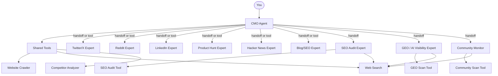

<div align="center">
  
</div>

<h1 align="center">OpenCMO</h1>

<div align="center">
  <strong>The open-source AI CMO that does what $99/month tools do — for free.</strong>
</div>
<br/>

<div align="center">
  <a href="README.md">🇺🇸 English</a> | <a href="README_zh.md">🇨🇳 中文</a>
</div>

<div align="center">
  <a href="https://www.python.org/downloads/"></a>
  <a href="LICENSE"></a>
  <a href="https://github.com/study8677/OpenCMO/stargazers"></a>
</div>

---

> **Okara charges $99/month. We charge $0.** And we cover more platforms.

## What is OpenCMO?

OpenCMO is a multi-agent AI system that acts as your full marketing team. Give it a URL — it crawls your site, extracts selling points, and generates ready-to-post content for **9 channels** through a simple CLI.

Built for **indie developers and small teams** who'd rather ship than write marketing copy.

## Why OpenCMO over paid alternatives?

| Capability | Okara ($99/mo) | OpenCMO (Free) |
|---|:---:|:---:|
| Twitter/X content | Yes | Yes |
| Reddit posts | Generate only | Generate + Monitor |
| LinkedIn posts | Planned | Yes |
| Product Hunt launch copy | No | Yes |
| Hacker News posts | Monitor only | Generate + Monitor |
| Blog/SEO articles | No | Yes |
| Web search (trends/competitors) | Yes | Yes |
| SEO audit | Yes | Yes |
| GEO score (AI visibility) | Yes | Yes |
| Community monitoring (Reddit + HN) | Yes | Yes |
| Competitor analysis | Yes | Yes |
| Multi-channel in one command | No | Yes |
| Open source | No | Yes |
| **Platforms covered** | **3** | **9** |

## Features

### 9 Platform Experts
- **Twitter/X** — Tweet variants & threads with scroll-stopping hooks
- **Reddit** — Authentic, story-driven posts for r/SideProject and niche subs
- **LinkedIn** — Professional, data-driven posts without corporate jargon
- **Product Hunt** — Taglines, descriptions, and Maker's first comment
- **Hacker News** — Understated, technically-focused Show HN posts
- **Blog/SEO** — SEO-friendly article outlines for Medium and Dev.to

### Marketing Intelligence
- **SEO Audit** — Single-page technical audit: title, meta, OG tags, headings, alt text, links — each issue with copy-pasteable fix
- **GEO Score** — AI search visibility analysis across Perplexity and You.com (0-100 score)
- **Competitor Analysis** — Structured intelligence: features, pricing, positioning, differentiation
- **Community Monitor** — Scan Reddit + HN discussions, surface high-value posts, draft authentic reply suggestions
- **Web Search** — Real-time competitive research, market trends, keyword discovery

### Smart Orchestration
- **Single platform** → handoff to expert for deep, interactive content creation
- **Multi-channel** → CMO calls all experts as tools, synthesizes a unified marketing plan
- **Context-aware** — Maintains conversation history with automatic truncation to prevent token overflow

## Architecture



## Quick Start

### 1. Install

```bash
pip install -e .
crawl4ai-setup
```

### 2. Configure

```bash
cp .env.example .env
# Add your OpenAI API key
```

### 3. Run

```bash
opencmo
```

## Example Sessions

```text
You: Help me create a full marketing plan for https://crawl4ai.com/

CMO is working...

[CMO Agent]
Here's your complete multi-platform marketing plan for Crawl4AI:

## Twitter/X
1. "Stop writing scrapers. One line of Python → LLM-ready markdown from any URL..."
...

## Reddit (r/SideProject)
"I built an open-source web crawler that outputs LLM-ready markdown..."
...

## LinkedIn / Product Hunt / Hacker News / Blog
...
```

```text
You: Audit the SEO of https://myproduct.com

[SEO Audit Expert]
# SEO Audit Report
[CRITICAL] Meta Description: Missing
  Fix: <meta name="description" content="...">
[WARNING] H1: Multiple H1 tags found (3)
...
```

```text
You: What's our GEO score for "web scraping"?

[AI Visibility Expert]
# GEO Score: 62/100
| Visibility | 30 | 40 |
| Position   | 17 | 30 |
| Sentiment  | 15 | 30 |
...
```

```text
You: Check Reddit and HN for discussions about Crawl4AI

[Community Monitor]
## Hacker News: 4 discussions found
- "Show HN: Crawl4AI — open-source LLM-friendly crawler" — 142 points
  Suggested reply: ...
## Reddit: 2 relevant threads
...
```

## Roadmap

- [x] 9 platform experts with multi-channel orchestration
- [x] SEO audit with actionable fixes
- [x] GEO score (AI search visibility)
- [x] Community monitoring (Reddit + HN)
- [x] Competitor analysis
- [x] Web search integration
- [ ] Web UI with real-time streaming
- [ ] Auto-publish via platform APIs
- [ ] GEO score tracking over time (SQLite persistence)
- [ ] Full-site SEO crawl (sitemap-based)
- [ ] Content calendar and scheduling
- [ ] Custom brand voice training

## Contributing

Contributions welcome! Fork, branch, PR.

**Ideas:**
- New platform experts (YouTube, Instagram, TikTok)
- Better prompts for existing agents
- Web UI frontend
- Auto-publish integrations

## License

Apache License 2.0 — see [LICENSE](LICENSE).

---

<div align="center">
  If OpenCMO saves you time, a <strong>Star ⭐</strong> would mean a lot!
</div>
