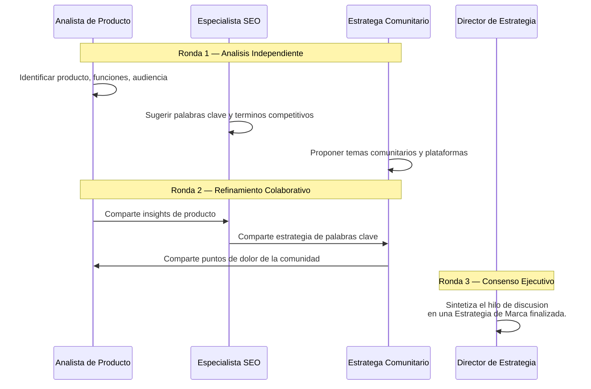

<div align="center">
  
</div>

<h1 align="center">OpenCMO</h1>

<p align="center">
  <strong>El CMO de IA de Codigo Abierto — Tu Equipo de Marketing Completo en Una Sola Herramienta.</strong><br/>
  <sub>Un potente sistema multiagente con mas de 25 expertos de IA, monitoreo continuo de SEO/GEO/SERP/Comunidad, una cola de aprobaciones con payload exacto y un grafo de conocimiento 3D interactivo.</sub>
</p>

<div align="center">
  <a href="README.md">English</a> | <a href="README_zh.md">中文</a> | <a href="README_ja.md">日本語</a> | <a href="README_ko.md">한국어</a> | <a href="README_es.md">Español</a>
</div>

<p align="center">
  <a href="https://www.python.org/downloads/"></a>
  <a href="LICENSE"></a>
  <a href="https://github.com/study8677/OpenCMO/stargazers"></a>
  
</p>

---

## Que es OpenCMO?

OpenCMO es un **ecosistema de marketing de IA multiagente** disenado para indie hackers, startups y equipos pequenos. Solo proporciona la URL de tu producto y OpenCMO:

1. **Analiza tu sitio web en profundidad** — Comprende tu producto y audiencia objetivo.
2. **Orquesta un debate estrategico multiagente** — Identifica las mejores palabras clave, posicionamiento y comunidades objetivo.
3. **Automatiza el monitoreo continuo** — Cubre SEO, visibilidad en busqueda IA (GEO), rankings SERP y comunidades de desarrolladores (Reddit, Hacker News, Dev.to).
4. **Genera contenido para mas de 20 plataformas** — Con revision del payload exacto en una cola de aprobaciones y publicacion automatica en Reddit y Twitter cuando tu lo autorizas.

---

## Por que OpenCMO destaca

- **Une generacion y medicion en un solo bucle** — agentes de contenido, monitoreo SEO/GEO/SERP/comunidad y el grafo 3D trabajan sobre la misma superficie operativa.
- **El scheduler ya vive en el ciclo de vida del dashboard web** — si `opencmo-web` esta activo, los monitores con cron tambien siguen activos.
- **La cola de aprobaciones guarda el payload exacto** — lo que revisas es exactamente lo que se publica.
- **Sigue siendo BYOK y extensible** — almacenamiento, APIs, scheduler y frontend siguen siendo faciles de inspeccionar y ampliar.

---

## Interfaz y Experiencia de Usuario

Una moderna React SPA con diseno glassmorphism, construida para maxima claridad y control.

<div align="center">
  
  <p><i>Dashboard de Proyectos en Tiempo Real — Monitorea SEO, GEO (Visibilidad IA), rankings SERP y engagement comunitario de un vistazo.</i></p>
</div>

<div align="center">
  <h3>
    <a href="https://www.bilibili.com/video/BV1T5AMzoEKV/">
      ▶ Ver el demo completo en Bilibili
    </a>
  </h3>
  <sub>Recorrido de 10 minutos con todas las funciones: Auditoria SEO, Deteccion GEO, Seguimiento SERP, Grafo de Conocimiento, Chat Multiagente y mas.</sub>
</div>

---

## Grafo de Conocimiento Interactivo

El **Grafo de Conocimiento** es el corazon de tu inteligencia de mercado — una red 3D interactiva dirigida por fuerzas que visualiza todo tu ecosistema de marketing.

<div align="center">
  
  <p><i>Mapa de red 3D dinamico que conecta tu marca, palabras clave, discusiones, competidores y rankings SERP.</i></p>
</div>

**Capacidades clave:**
- **Expansion activa del grafo** — Haz clic en "Start Exploring" y el grafo descubre competidores, palabras clave y conexiones ola por ola. Puedes pausar y reanudar cuando quieras.
- **Topologia BFS por profundidad** — Los nodos descubiertos se conectan con su nodo padre en lugar de aplanarse contra la marca. Los nodos mas profundos se ven mas pequenos y mas tenues.
- **Visualizacion de frontera** — Los nodos aun no explorados se resaltan con un anillo violeta para mostrar hacia donde puede crecer el grafo.
- **Exploracion interactiva** — Zoom, arrastre y desplazamiento por el universo digital de tu marca.
- **6 dimensiones de nodos** — Marca (purpura), Palabras clave (cian), Discusiones comunitarias (ambar), Rankings SERP (verde), Competidores (rojo), Palabras clave superpuestas (naranja).
- **Inteligencia competitiva** — Agrega URLs de competidores para visualizar campos de batalla compartidos con lineas punteadas rojas.
- **Sincronizacion en tiempo real** — El grafo se reequilibra cada 30 segundos (cada 5 segundos durante la expansion activa).
- **Descubrimiento de competidores con IA** — Identifica automaticamente competidores y rastrea palabras clave superpuestas.

---

## Funcionalidades Destacadas

### Auditoria SEO

Utiliza la API de Google PageSpeed Insights para auditar continuamente puntuacion de rendimiento, Core Web Vitals (LCP, CLS, TBT), Schema.org, robots.txt y sitemaps.

<div align="center">
  
  <p><i>Grafico de tendencia de rendimiento y analisis detallado de Core Web Vitals.</i></p>
</div>

### Deteccion GEO (Visibilidad en Busqueda IA)

Monitorea la visibilidad de tu marca en motores de busqueda IA: Perplexity, You.com, ChatGPT, Claude y Gemini.

<div align="center">
  
  <p><i>Tendencia de puntuacion de visibilidad de marca en plataformas de busqueda IA.</i></p>
</div>

### Seguimiento SERP

Rastrea continuamente las posiciones de busqueda de tus palabras clave objetivo. Compatible con web crawling o la API de DataForSEO.

<div align="center">
  
  <p><i>Lista de posiciones de palabras clave y grafico de historial de rankings.</i></p>
</div>

### Monitoreo de Comunidad

Escanea automaticamente menciones de marca y discusiones relevantes en Reddit, Hacker News y Dev.to.

<div align="center">
  
  <p><i>Historial de escaneos multiplataforma y discusiones en seguimiento.</i></p>
</div>

### Cola de aprobaciones y operaciones programadas

Revisa el payload exacto de publicacion dentro de la SPA, apruebalo o rechaza con traza persistente, y deja que el proceso web mantenga vivos los monitores programados. La publicacion real sigue respetando `OPENCMO_AUTO_PUBLISH=1`, asi que la aprobacion no salta la ultima barrera de seguridad.

---

## Tu Equipo de Marketing IA

OpenCMO incluye **mas de 25 agentes de IA especializados** organizados en tres categorias:

### Agentes de Inteligencia de Mercado

| Agente | Responsabilidad |
| :--- | :--- |
| **Agente CMO** | El orquestador. Enruta tareas automaticamente al experto adecuado. |
| **Auditor SEO** | Audita Core Web Vitals, Schema.org, robots.txt y sitemaps via Google PageSpeed API. |
| **Especialista GEO** | Monitorea la visibilidad de tu marca en Perplexity, You.com, ChatGPT, Claude y Gemini. |
| **Radar Comunitario** | Escanea Reddit, Hacker News y Dev.to en busca de menciones de marca y discusiones relevantes. |

### Agentes de Creacion de Contenido (Global)

| Agente | Plataforma |
| :--- | :--- |
| **Experto Twitter/X** | Tweets, hooks y hilos virales |
| **Estratega Reddit** | Posts autenticos y respuestas inteligentes en subreddits |
| **Pro LinkedIn** | Posts profesionales de liderazgo de opinion |
| **Experto Product Hunt** | Taglines, descripciones y comentarios de makers |
| **Formateador Hacker News** | Posts tecnicos "Show HN" |
| **Escritor Blog/SEO** | Articulos largos optimizados para SEO (2000+ palabras) |
| **Experto Dev.to** | Articulos para comunidad de desarrolladores |

### Agentes de Creacion de Contenido (Plataformas Chinas)

| Agente | Plataforma |
| :--- | :--- |
| **Experto Zhihu** | Zhihu - Plataforma de preguntas y respuestas |
| **Experto Xiaohongshu** | RED (Xiaohongshu) - Comercio social |
| **Experto V2EX** | V2EX - Foro de desarrolladores |
| **Experto Juejin** | Juejin - Comunidad de desarrolladores |
| **Experto Jike** | Jike - Plataforma social |
| **Experto WeChat** | Ecosistema WeChat |
| **Experto OSChina** | OSChina - Codigo abierto |
| **Experto GitCode** | GitCode - Plataforma de codigo abierto |
| **Experto SSPAI** | SSPAI - Productividad |
| **Experto InfoQ** | InfoQ China - Medios tecnologicos |
| **Experto Ruanyifeng** | Formato de envio para el semanario Ruanyifeng |

---

## Integraciones de Plataformas

Todas las integraciones se configuran directamente desde el **panel de Configuracion** del dashboard web — no es necesario editar archivos `.env`.

<div align="center">
  
  <p><i>Panel de configuracion unificado — Configura todas las claves API e integraciones de plataformas desde la interfaz web.</i></p>
</div>

### Monitoreo y Analisis (automatico)

| Capacidad | Plataformas | Metodo |
| :--- | :--- | :--- |
| **Monitoreo Comunitario** | Reddit, Hacker News, Dev.to | APIs publicas (sin autenticacion) |
| **Deteccion GEO** | Perplexity, You.com | Web crawling (sin autenticacion) |
| **Deteccion GEO** | ChatGPT, Claude, Gemini | Llamadas API (configurar claves en Ajustes) |
| **Auditoria SEO** | Google PageSpeed Insights | HTTP API (clave opcional para limites mayores) |
| **Seguimiento SERP** | Google, DataForSEO | Web crawling o API DataForSEO |

### Publicacion (controlada por el usuario)

| Plataforma | Metodo | Configuracion |
| :--- | :--- | :--- |
| **Reddit** | PRAW (publicar + responder) | Configurar credenciales de app Reddit en Ajustes |
| **Twitter/X** | Tweepy (tweets) | Configurar credenciales API de Twitter en Ajustes |

### Reportes

| Funcion | Metodo | Configuracion |
| :--- | :--- | :--- |
| **Reportes por Email** | SMTP | Configurar credenciales SMTP en Ajustes |

> Los demas agentes (LinkedIn, Product Hunt, plataformas chinas, etc.) generan contenido listo para usar que puedes copiar y pegar en la plataforma destino.

---

## Como Funciona: Debate Multiagente

Al enviar una URL, OpenCMO organiza una **discusion colaborativa de 3 rondas** entre agentes especializados:



Al permitir que los agentes lean y reaccionen entre si, OpenCMO produce estrategias fundamentalmente mas ricas que las respuestas de IA de un solo paso.

<div align="center">
  
  <p><i>Discusion de analisis multiagente — Multiples agentes especializados colaborando en tiempo real.</i></p>
</div>

---

## Interfaz de Chat IA

Conversa directamente con mas de 25 agentes especializados. El agente CMO enruta automaticamente al experto optimo. Respuestas en tiempo real via streaming SSE.

<div align="center">
  
  <p><i>Grilla de seleccion de expertos y chat con streaming — Acceso instantaneo a expertos de marketing.</i></p>
</div>

---

## Guia de Inicio Rapido

OpenCMO es compatible con cualquier API compatible con OpenAI (**OpenAI, DeepSeek, NVIDIA NIM, Ollama**, etc.).

### 1. Instalacion

```bash
git clone https://github.com/study8677/OpenCMO.git
cd OpenCMO

# Instalar todas las dependencias Python
pip install -e ".[all]"

# Inicializar playbooks del crawler
crawl4ai-setup
```

### 2. Configuracion

```bash
cp .env.example .env
```
Edita `.env` con tus credenciales de proveedor. *Ejemplo para OpenAI:*
```env
OPENAI_API_KEY=sk-yourAPIKeyHere
OPENCMO_MODEL_DEFAULT=gpt-4o
```

> **Consejo:** Tambien puedes configurar todas las claves API directamente desde el panel de **Configuracion** del dashboard web — no es necesario editar `.env` despues de la configuracion inicial.

### 3. Iniciar el Dashboard

```bash
opencmo-web
```
Abre [http://localhost:8080/app](http://localhost:8080/app) en tu navegador.

> *Prefieres la terminal? Ejecuta `opencmo` para el modo chatbot CLI interactivo.*

### 4. Desarrollo Frontend (opcional)

```bash
cd frontend
npm install
npm run dev     # Servidor dev en localhost:5173 (proxy API a :8080)
npm run build   # Build de produccion
```

---

## Hoja de Ruta

- [x] **Mas de 25 expertos IA en marketing** — Chat con enrutamiento inteligente
- [x] **Analisis de URL multiagente** — Via debate colaborativo
- [x] **React SPA** — Soporte multiidioma (EN/ZH)
- [x] **API agnostico** — OpenAI, Anthropic, DeepSeek, NVIDIA, Ollama
- [x] **Grafo de conocimiento 3D interactivo** — Con expansion BFS activa e inteligencia competitiva
- [x] **Monitoreo comunitario** — Reddit, Hacker News, Dev.to
- [x] **Deteccion GEO** — Perplexity, You.com, ChatGPT, Claude, Gemini
- [x] **Auditoria SEO** — Core Web Vitals, Schema.org, robots.txt
- [x] **Seguimiento SERP** — Monitoreo de rankings de palabras clave
- [x] **Cola de aprobaciones + runtime de monitores programados** — Revision exacta del payload y ejecucion cron en el ciclo web
- [x] **Publicacion automatica** — Reddit (publicar + responder) y Twitter
- [x] **Reportes por email** — Via SMTP
- [x] **Descubrimiento de competidores con IA** — Analisis de superposicion de palabras clave
- [x] **Panel de configuracion unificado** — Configura todas las claves API desde la UI web
- [ ] Publicacion directa en LinkedIn, Product Hunt y mas
- [ ] Afinacion personalizada de voz de marca
- [ ] Crawls SEO de sitio completo a nivel empresarial

---

<p align="center">
  Hecho con dedicacion por la Comunidad de Codigo Abierto.<br/>
  <b>Si OpenCMO te ahorra tiempo, por favor dale una estrella en GitHub!</b>
</p>
