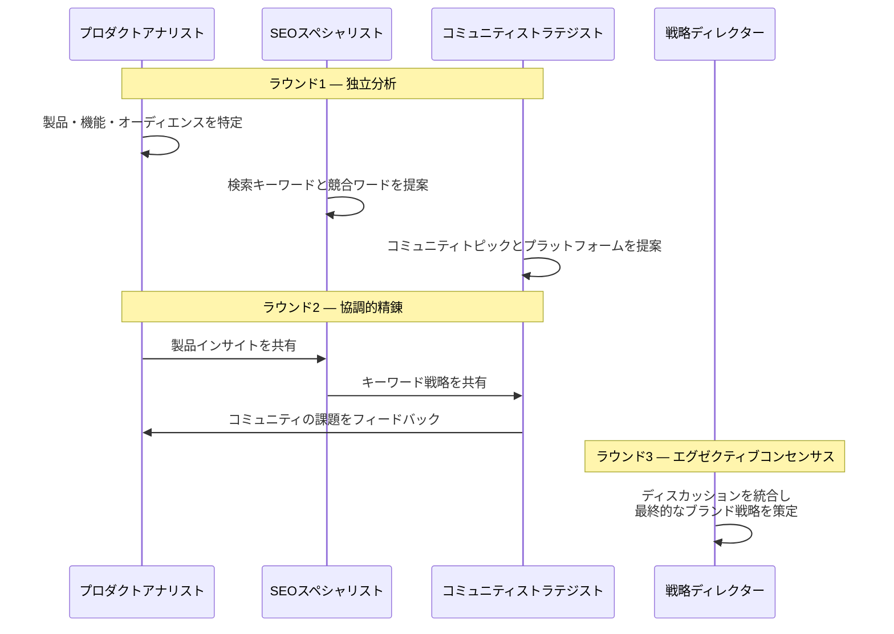

<div align="center">
  
</div>

<h1 align="center">OpenCMO</h1>

<p align="center">
  <strong>オープンソース AI 最高マーケティング責任者 — 1つのツールで完結する、あなた専属のマーケティングチーム</strong><br/>
  <sub>25名以上の専門AIエージェント、常時稼働するSEO/GEO/SERP/コミュニティ監視、正確な投稿 payload を保持する承認キュー、インタラクティブ3Dナレッジグラフを備えたマルチエージェントシステム。</sub>
</p>

<div align="center">
  <a href="README.md">English</a> | <a href="README_zh.md">中文</a> | <a href="README_ja.md">日本語</a> | <a href="README_ko.md">한국어</a> | <a href="README_es.md">Español</a>
</div>

<p align="center">
  <a href="https://www.python.org/downloads/"></a>
  <a href="LICENSE"></a>
  <a href="https://github.com/study8677/OpenCMO/stargazers"></a>
</p>

---

## OpenCMOとは？

OpenCMOは、インディーハッカー、スタートアップ、少人数チームのための**マルチエージェントAIマーケティングエコシステム**です。製品のURLを入力するだけで、OpenCMOが以下を実行します：

1. **ウェブサイトを深層分析** — 製品特性とターゲットオーディエンスを把握。
2. **マルチエージェント戦略ディベート** — 最適なキーワード、ポジショニング、ターゲットコミュニティを特定。
3. **継続的モニタリングを自動化** — SEO、AI検索可視性（GEO）、SERPキーワードランキング、開発者コミュニティ（Reddit、Hacker News、Dev.to）を網羅。
4. **20以上のプラットフォーム向けコンテンツ生成** — 承認キューで正確な投稿 payload を確認し、明示的に許可したときだけ Reddit と Twitter へ自動投稿します。

---

## OpenCMOが差別化される理由

- **生成と計測を同じループに乗せる** — コンテンツエージェント、SEO/GEO/SERP/コミュニティ監視、3Dグラフが別々のツールではなく、同じ運用面でつながります。
- **スケジューラが Web アプリのライフサイクルで動作する** — `opencmo-web` が起動していれば、保存済みの cron モニタも継続して動きます。
- **承認キューは一時的なプレビューではない** — レビューした payload そのものが、最終的に実行される payload です。
- **BYOK と拡張性を維持** — ストレージ、API、スケジューラ、React SPA を自分の運用に合わせて拡張しやすい構成です。

---

## インターフェースとユーザー体験

グラスモーフィズムデザインを採用したモダンなReact SPA。最大限の視認性とコントロールを実現。

<div align="center">
  
  <p><i>リアルタイムプロジェクトダッシュボード — SEO、GEO（AI可視性）、SERPランキング、コミュニティエンゲージメントを一目で把握。</i></p>
</div>

<div align="center">
  <h3>
    <a href="https://www.bilibili.com/video/BV1T5AMzoEKV/">
      ▶ Bilibili でフルデモ動画を視聴
    </a>
  </h3>
  <sub>10分間の全機能ウォークスルー：SEO監査、GEO検出、SERPトラッキング、ナレッジグラフ、マルチエージェントチャットなど。</sub>
</div>

---

## インタラクティブ・ナレッジグラフ

**ナレッジグラフ**はマーケティングインテリジェンスの中核 — マーケティングエコシステム全体を可視化するインタラクティブ3Dフォースダイレクテッドネットワーク。

<div align="center">
  
  <p><i>ブランド、キーワード、コミュニティ討論、競合他社、SERPランキングを結ぶ動的3Dネットワークマップ。</i></p>
</div>

**主要機能：**
- **アクティブなグラフ拡張** — 「Start Exploring」を押すと、グラフが波ごとに競合、キーワード、関係性を自律的に発見します。いつでも一時停止・再開できます。
- **BFS 深度トポロジー** — 発見されたノードはブランドに平坦化されず、親ノードにつながります。深いノードほど小さく淡く表示されます。
- **フロンティア可視化** — 未探索ノードは紫のワイヤーリングで強調され、次に拡張できる方向が見えます。
- **インタラクティブ探索** — ズーム、ドラッグ、パンでブランドのデジタル空間を探索。
- **6つのノード次元** — ブランド（紫）、キーワード（シアン）、コミュニティ討論（アンバー）、SERP順位（グリーン）、競合（レッド）、重複キーワード（オレンジ）。
- **競合インテリジェンス** — 競合URLを追加し、赤い点線で共通の戦場を可視化。
- **リアルタイム同期** — 30秒ごとにグラフを自動更新し、アクティブ拡張中は5秒間隔まで加速します。
- **AI駆動の競合発見** — 競合を自動識別し、キーワードの重複を追跡。

---

## 機能ハイライト

### SEO監査

Googleの PageSpeed Insights API を活用し、パフォーマンススコア、Core Web Vitals（LCP、CLS、TBT）、Schema.org、robots.txt、サイトマップを継続的に監査。**AIクローラー検出**（GPTBot、ClaudeBot、PerplexityBot、Google-Extended など14種の AI クローラーを robots.txt で確認）と **llms.txt** の検証・生成（AI クローラー向けガイダンスの新興標準）にも対応。

<div align="center">
  
  <p><i>パフォーマンス推移チャートとCore Web Vitalsの詳細分析。</i></p>
</div>

### GEO検出（AI検索可視性）

Perplexity、You.com、ChatGPT、Claude、GeminiにおけるブランドのAI検索エンジン可視性を監視。**引用可能性スコアリング**（5次元 AI 引用準備度分析）、**ブランドデジタルフットプリント**スキャン（YouTube、Reddit、Wikipedia、Wikidata、LinkedIn の存在を相関加重スコアリング）、**AIクローラーアクセス**検出（GPTBot、ClaudeBot、PerplexityBot を含む14種のクローラー）で強化。

<div align="center">
  
  <p><i>AI検索プラットフォームにおけるブランド可視性スコアの推移。</i></p>
</div>

### SERPトラッキング

ターゲットキーワードの検索順位を継続追跡。ウェブクローリングまたはDataForSEO APIに対応。

<div align="center">
  
  <p><i>キーワードポジション一覧と順位履歴チャート。</i></p>
</div>

### コミュニティモニタリング

**Reddit、Hacker News、Dev.to、YouTube、Bluesky、Twitter/X** でのブランド言及と関連ディスカッションを自動スキャン。マルチシグナルスコアリング（エンゲージメント速度、テキスト関連性、時間減衰、クロスプラットフォーム収束検出）でプラットフォーム横断の比較可能なランキングを実現。

<div align="center">
  
  <p><i>プラットフォーム横断のスキャン履歴とトラッキング中のディスカッション。</i></p>
</div>

### トレンドリサーチ

**トレンドリサーチ Agent** がコミュニティプラットフォーム全体でトピックを調査。クエリ拡張、比較モード（「X vs Y」）、時間枠フィルタリングに対応し、マルチシグナルスコアリングで実用的なブリーフィングを生成。

### プロアクティブインサイト

OpenCMO は確認を待ちません——**重要なことがあれば教えてくれます**。7つのルールベース検出器（LLMコストゼロ）が SERP ランキング低下、GEO スコア低下、高エンゲージメントの社区ディスカッション、SEO パフォーマンス低下、競合キーワードギャップ、**引用可能性スコアの低下**、**AIクローラーブロック**を継続監視。インサイトは通知ベルバッジとダッシュボード上のプライオリティバナーに表示され、アクション可能な CTA ボタン付き。

### グラフインテリジェンス

ナレッジグラフは単なるビジュアライゼーションではなく**アクティブインテリジェンスレイヤー**に。グラフデータ（競合関係、キーワードギャップ、SERP ランキング）がチャットセッションとリサーチブリーフに自動注入され、CMO Agent はいつでも `get_competitive_landscape` で競争環境を照会可能。

### 承認キューと定期実行オペレーション

SPA 上で正確な投稿 payload を確認し、承認または却下の履歴を残しながら、Web プロセスに定期モニタを走らせ続けます。実際の投稿は引き続き `OPENCMO_AUTO_PUBLISH=1` を尊重するため、承認が最後の安全装置を迂回することはありません。

---

## AIマーケティングチーム

OpenCMOには**25名以上の専門AIエージェント**が搭載されており、3つのカテゴリに分類されます：

### マーケットインテリジェンスエージェント

| エージェント | 担当領域 |
| :--- | :--- |
| **CMOエージェント** | オーケストレーター。タスクを最適なエキスパートに自動ルーティング。 |
| **SEO監査エージェント** | Google PageSpeed APIでCore Web Vitals、Schema.org、robots.txt、サイトマップを監査。 |
| **GEOスペシャリスト** | Perplexity、You.com、ChatGPT、Claude、Geminiでのブランド可視性を監視。 |
| **コミュニティレーダー** | Reddit、Hacker News、Dev.toでブランド言及と関連ディスカッションをスキャン。 |

### コンテンツ作成エージェント（グローバル）

| エージェント | 対象プラットフォーム |
| :--- | :--- |
| **Twitter/X エキスパート** | ツイート、フック、バイラルスレッド |
| **Reddit ストラテジスト** | 自然な投稿とサブレディットへのスマートリプライ |
| **LinkedIn プロ** | プロフェッショナルなソートリーダーシップ投稿 |
| **Product Hunt エキスパート** | タグライン、説明文、メーカーコメント |
| **Hacker News フォーマッター** | テクニカルな "Show HN" 投稿 |
| **Blog/SEO ライター** | 2000語以上のSEO最適化長文記事 |
| **Dev.to エキスパート** | 開発者コミュニティ向け記事 |

### コンテンツ作成エージェント（中国語プラットフォーム）

| エージェント | 対象プラットフォーム |
| :--- | :--- |
| **知乎エキスパート** | 知乎 Q&Aプラットフォーム |
| **小紅書エキスパート** | RED（小紅書）ソーシャルコマース |
| **V2EX エキスパート** | V2EX 開発者フォーラム |
| **掘金エキスパート** | 掘金 開発者コミュニティ |
| **即刻エキスパート** | 即刻 ソーシャルプラットフォーム |
| **微信エキスパート** | 微信エコシステム |
| **OSChina エキスパート** | 開源中国 |
| **GitCode エキスパート** | GitCode オープンソースプラットフォーム |
| **少数派エキスパート** | SSPAI プロダクティビティ |
| **InfoQ エキスパート** | InfoQ China テックメディア |
| **阮一峰ウィークリー** | 阮一峰科技愛好者週刊 投稿フォーマット |

---

## プラットフォーム連携

すべての連携はWebダッシュボードの**設定パネル**から直接設定可能 — `.env`ファイルの手動編集は不要です。

<div align="center">
  
  <p><i>統合設定パネル — すべてのAPIキーとプラットフォーム連携をWeb UIから設定。</i></p>
</div>

### モニタリングと分析（自動）

| 機能 | プラットフォーム | 方式 |
| :--- | :--- | :--- |
| **コミュニティ監視** | Reddit, Hacker News, Dev.to | パブリックAPI（認証不要） |
| **GEO検出** | Perplexity, You.com | ウェブクローリング（認証不要） |
| **GEO検出** | ChatGPT, Claude, Gemini | API呼び出し（設定でキーを構成） |
| **SEO監査** | Google PageSpeed Insights | HTTP API（オプションキーで上限増加） |
| **SERPトラッキング** | Google, DataForSEO | ウェブクローリングまたはDataForSEO API |

### パブリッシング（ユーザー制御）

| プラットフォーム | 方式 | セットアップ |
| :--- | :--- | :--- |
| **Reddit** | PRAW（投稿＋リプライ） | 設定でRedditアプリ認証情報を構成 |
| **Twitter/X** | Tweepy（ツイート） | 設定でTwitter API認証情報を構成 |

### レポーティング

| 機能 | 方式 | セットアップ |
| :--- | :--- | :--- |
| **メールレポート** | SMTP | 設定でSMTP認証情報を構成 |

> その他のエージェント（LinkedIn、Product Hunt、中国語プラットフォームなど）はすぐに使えるコンテンツを生成します。ターゲットプラットフォームにコピー＆ペーストするだけです。

---

## マルチエージェント・ディベートの仕組み

URLを送信すると、OpenCMOは専門エージェントによる**3ラウンドの協調ディスカッション**を実行します：



エージェント同士が互いの分析を読み、反応することで、単発のAI応答よりも遥かに豊かな戦略を生み出します。

<div align="center">
  
  <p><i>マルチエージェント分析ディスカッション — 複数の専門エージェントがリアルタイムで協調。</i></p>
</div>

---

## AIチャットインターフェース

25名以上の専門エージェントと直接対話。CMOエージェントが自動で最適なエキスパートにルーティング。SSEストリーミングによるリアルタイム応答。

<div align="center">
  
  <p><i>エキスパート選択グリッドとストリーミングチャット — マーケティングの専門家にいつでもアクセス。</i></p>
</div>

---

## クイックスタートガイド

OpenCMOはOpenAI互換のあらゆるAPIに対応（**OpenAI、DeepSeek、NVIDIA NIM、Ollama**など）。

### 1. インストール

```bash
git clone https://github.com/study8677/OpenCMO.git
cd OpenCMO

# すべてのPython依存関係をインストール
pip install -e ".[all]"

# クローラーの初期設定
crawl4ai-setup
```

### 2. 設定

```bash
cp .env.example .env
```
`.env`にプロバイダーの認証情報を設定します。*OpenAIの例：*
```env
OPENAI_API_KEY=sk-yourAPIKeyHere
OPENCMO_MODEL_DEFAULT=gpt-4o
```

> **ヒント：** Webダッシュボードの**設定**パネルからすべてのAPIキーを直接設定することもできます。初期セットアップ後は`.env`の手動編集は不要です。

### 3. ダッシュボードの起動

```bash
opencmo-web
```
ブラウザで [http://localhost:8080/app](http://localhost:8080/app) を開きます。

> *ターミナル派？ `opencmo` を実行すれば、インタラクティブCLIチャットボットモードが利用できます。*

### 4. フロントエンド開発（オプション）

```bash
cd frontend
npm install
npm run dev     # 開発サーバー localhost:5173（APIを:8080にプロキシ）
npm run build   # プロダクションビルド
```

---

## ロードマップ

- [x] **25名以上のAIマーケティングエキスパート** — チャットとインテリジェントルーティング
- [x] **マルチエージェントURL分析** — 協調ディベートによる分析
- [x] **React SPA** — 多言語対応（EN/ZH）
- [x] **API非依存** — OpenAI、Anthropic、DeepSeek、NVIDIA、Ollama
- [x] **インタラクティブ3Dナレッジグラフ** — アクティブ BFS 拡張と競合インテリジェンス付き
- [x] **コミュニティ監視** — Reddit、Hacker News、Dev.to
- [x] **GEO検出** — Perplexity、You.com、ChatGPT、Claude、Gemini
- [x] **SEO監査** — Core Web Vitals、Schema.org、robots.txt
- [x] **SERPトラッキング** — キーワードランキング監視
- [x] **承認キュー + 定期モニタ実行基盤** — 正確な payload レビューと Web ライフサイクル内 cron 実行
- [x] **自動投稿** — Reddit（投稿＋リプライ）とTwitter
- [x] **メールレポート** — SMTP送信
- [x] **AI駆動の競合発見** — キーワード重複分析
- [x] **マルチシグナル社区スコアリング** — エンゲージメント速度、テキスト関連性、時間減衰、クロスプラットフォーム収束検出
- [x] **トレンドリサーチ Agent** — クエリ拡張と比較モード付きの話題探索
- [x] **グラフインテリジェンスパイプライン** — ナレッジグラフがAgent決策・チャット・コンテンツブリーフに反映
- [x] **プロアクティブインサイトエンジン** — SERPランキング低下/GEO低下/コミュニティ注目/SEO低下/競合ギャップ検出+アクション可能CTA
- [x] **統合設定パネル** — Web UIからすべてのAPIキーを設定
- [x] **GEO最適化ツールキット** — 引用可能性スコアリング（5次元AI引用準備度）、AIクローラー検出（14種）、ブランドデジタルフットプリントスキャン（YouTube/Reddit/Wikipedia/LinkedIn）、llms.txt 検証・生成。[geo-seo-claude](https://github.com/zubair-trabzada/geo-seo-claude) にインスパイア
- [ ] LinkedIn、Product Huntなどへの直接投稿
- [ ] カスタムブランドボイスのファインチューニング
- [ ] エンタープライズグレードのフルサイトSEOクロール

---

## Contributors

- [study8677](https://github.com/study8677) - OpenCMO の作成者兼メンテナ
- [ParakhJaggi](https://github.com/ParakhJaggi) - [#2](https://github.com/study8677/OpenCMO/pull/2) と [#3](https://github.com/study8677/OpenCMO/pull/3) による Tavily 統合の貢献
- 継続的に管理する貢献者一覧は [CONTRIBUTORS.md](CONTRIBUTORS.md) を参照
- 貢献フロー、PR の期待事項、クレジットの扱いは [CONTRIBUTING.md](CONTRIBUTING.md) を参照

> GitHub の既定の Contributors グラフは、commit author のメールアドレスが GitHub アカウントに紐付いているかどうかで集計されます。紐付いていないメールアドレスで作成されたコミットがマージされた場合、実際に貢献していても既定のグラフには表示されないことがあります。

---

## 謝辞

- [geo-seo-claude](https://github.com/zubair-trabzada/geo-seo-claude)（[@zubair-trabzada](https://github.com/zubair-trabzada) 作）— Claude Code 向けの包括的な GEO（生成エンジン最適化）監査ツールキット。OpenCMO の GEO モジュールは、引用可能性スコアリングフレームワーク、AIクローラー検出アプローチ（GPTBot、ClaudeBot、PerplexityBot を含む14種以上）、プラットフォーム別最適化マトリクス（Google AIO、ChatGPT、Perplexity、Gemini、Bing Copilot 向けの個別戦略）、E-E-A-T 評価手法にインスパイアされています。
- [last30days-skill](https://github.com/mvanhorn/last30days-skill)（[@mvanhorn](https://github.com/mvanhorn) 作）— OpenCMO のマルチシグナルスコアリングシステム、クロスプラットフォーム収束検出、トレンドリサーチツールは、last30days のマルチプラットフォームコミュニティリサーチと品質ランキングアプローチにインスパイアされています。

---

<p align="center">
  オープンソースコミュニティによって丁寧に作られました。<br/>
  <b>OpenCMOが役に立ったら、GitHubでスターをお願いします！</b>
</p>
