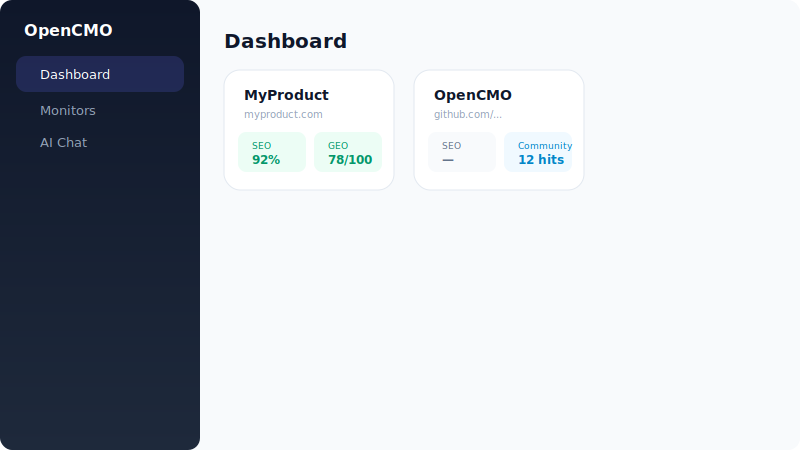
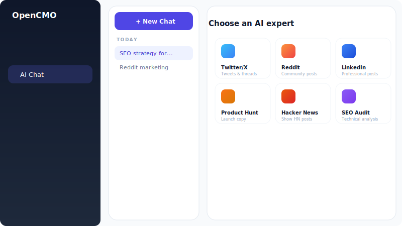
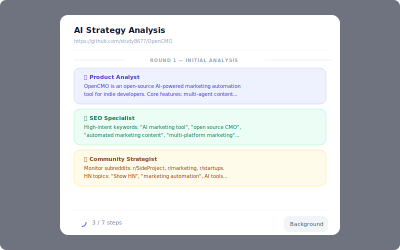

<div align="center">
  
</div>

<h1 align="center">OpenCMO</h1>

<p align="center">
  <strong>オープンソース AI CMO — ひとつのツールでマーケティングチーム全体をカバー。</strong><br/>
  <sub>10のAIエキスパートエージェント、リアルタイム監視、モダンなWebダッシュボード。</sub>
</p>

<div align="center">
  <a href="README.md">🇺🇸 English</a> | <a href="README_zh.md">🇨🇳 中文</a> | <a href="README_ja.md">🇯🇵 日本語</a> | <a href="README_ko.md">🇰🇷 한국어</a> | <a href="README_es.md">🇪🇸 Español</a>
</div>

<div align="center">
  <a href="https://www.python.org/downloads/"></a>
  <a href="LICENSE"></a>
  <a href="https://github.com/study8677/OpenCMO/stargazers"></a>
</div>

---

## スクリーンショット

<div align="center">
  
  <br/><sub>プロジェクトダッシュボード — SEO、GEO、コミュニティ、SERPスコア</sub>
</div>
<br/>
<div align="center">
  
  <br/><sub>10のAIエキスパートとチャット — 選択するかCMOに自動ルーティング</sub>
</div>
<br/>
<div align="center">
  
  <br/><sub>マルチエージェント戦略議論：3役割 × 3ラウンド → キーワードと監視計画</sub>
</div>

---

## OpenCMOとは？

インディー開発者や小規模チーム向けの**マルチエージェントAIマーケティングシステム**です。URLを入力するだけで、サイトをクロールし、マルチエージェント戦略議論を実行し、SEO・AI可視性・コミュニティの監視を自動設定します。

## クイックスタート

```bash
git clone https://github.com/study8677/OpenCMO.git
cd OpenCMO
pip install -e ".[all]"
crawl4ai-setup
cp .env.example .env  # APIキーを設定
opencmo-web           # → http://localhost:8080/app
```

## 🤖 10のAIエキスパート

| エージェント | 機能 |
|------------|------|
| **CMO Agent** | 全体統括、適切なエキスパートに自動ルーティング |
| **Twitter/X** | ツイート、スレッド |
| **Reddit** | コミュニティ投稿 |
| **LinkedIn** | プロフェッショナルコンテンツ |
| **Product Hunt** | ローンチコピー |
| **Hacker News** | Show HN投稿 |
| **Blog/SEO** | SEO最適化記事 |
| **SEO監査** | Core Web Vitals、Schema.org分析 |
| **GEO** | AI検索エンジンでのブランド言及チェック |
| **コミュニティ** | Reddit/HN/Dev.toの議論スキャン |

## ライセンス

Apache License 2.0

---

<div align="center">
  <sub>OpenCMOが役立ったら ⭐ をお願いします！</sub>
</div>
