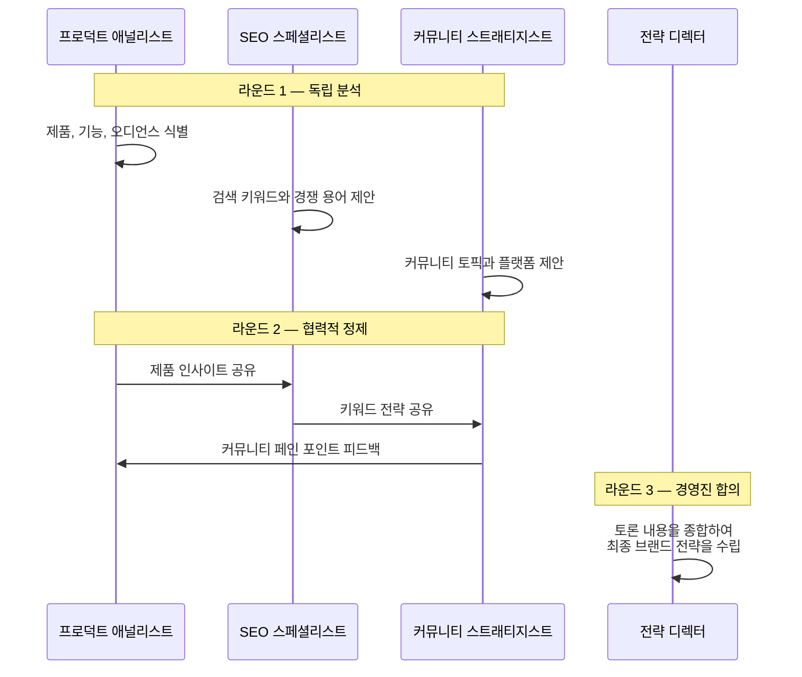

<div align="center">
  
</div>

<h1 align="center">OpenCMO</h1>

<p align="center">
  <strong>오픈소스 AI 최고 마케팅 책임자 — 하나의 도구로 완성하는 전담 마케팅 팀</strong><br/>
  <sub>25명 이상의 전문 AI 에이전트, 상시 동작하는 SEO/GEO/SERP/커뮤니티 모니터링, 정확한 게시 payload 를 보존하는 승인 큐, 인터랙티브 3D 지식 그래프를 갖춘 강력한 멀티 에이전트 시스템.</sub>
</p>

<div align="center">
  <a href="README.md">English</a> | <a href="README_zh.md">中文</a> | <a href="README_ja.md">日本語</a> | <a href="README_ko.md">한국어</a> | <a href="README_es.md">Español</a>
</div>

<p align="center">
  <a href="https://www.python.org/downloads/"></a>
  <a href="LICENSE"></a>
  <a href="https://github.com/study8677/OpenCMO/stargazers"></a>
  
</p>

---

## OpenCMO란?

OpenCMO는 인디 해커, 스타트업, 소규모 팀을 위한 **멀티 에이전트 AI 마케팅 에코시스템**입니다. 제품 URL만 입력하면 OpenCMO가 다음을 수행합니다:

1. **웹사이트 심층 분석** — 제품 특성과 타겟 오디언스를 파악합니다.
2. **멀티 에이전트 전략 토론 진행** — 최적의 키워드, 포지셔닝, 타겟 커뮤니티를 식별합니다.
3. **지속적 모니터링 자동화** — SEO, AI 검색 가시성(GEO), SERP 키워드 순위, 개발자 커뮤니티(Reddit, Hacker News, Dev.to)를 포괄합니다.
4. **20개 이상의 플랫폼용 콘텐츠 생성** — 승인 큐에서 정확한 게시 payload 를 검토한 뒤, 명시적으로 허용했을 때만 Reddit과 Twitter에 자동 게시합니다.

---

## OpenCMO가 차별화되는 이유

- **생성과 측정을 하나의 루프로 묶습니다** — 콘텐츠 에이전트, SEO/GEO/SERP/커뮤니티 모니터링, 3D 그래프가 따로 놀지 않고 같은 운영 화면에서 연결됩니다.
- **스케줄러가 Web 앱 라이프사이클 안에서 동작합니다** — `opencmo-web` 가 떠 있으면 저장된 cron 모니터도 계속 실행됩니다.
- **승인 큐는 일회성 미리보기가 아닙니다** — 검토한 payload 자체가 실제로 실행되는 payload 입니다.
- **BYOK 와 확장성을 유지합니다** — 저장소, API, 스케줄러, React SPA 를 팀 흐름에 맞게 쉽게 확장할 수 있습니다.

---

## 인터페이스 및 사용자 경험

글래스모피즘 디자인의 모던한 React SPA. 최대한의 가시성과 제어력을 제공합니다.

<div align="center">
  
  <p><i>실시간 프로젝트 대시보드 — SEO, GEO(AI 가시성), SERP 순위, 커뮤니티 참여도를 한눈에 확인.</i></p>
</div>

<div align="center">
  <h3>
    <a href="https://www.bilibili.com/video/BV1T5AMzoEKV/">
      ▶ Bilibili에서 전체 데모 영상 시청
    </a>
  </h3>
  <sub>10분 전체 기능 워크스루: SEO 감사, GEO 감지, SERP 트래킹, 지식 그래프, 멀티 에이전트 채팅 등.</sub>
</div>

---

## 인터랙티브 지식 그래프

**지식 그래프**는 마케팅 인텔리전스의 핵심 — 전체 마케팅 에코시스템을 시각화하는 인터랙티브 3D 포스 다이렉티드 네트워크입니다.

<div align="center">
  
  <p><i>브랜드, 키워드, 커뮤니티 토론, 경쟁사, SERP 순위를 연결하는 동적 3D 네트워크 맵.</i></p>
</div>

**핵심 기능:**
- **능동형 그래프 확장** — "Start Exploring"을 누르면 그래프가 경쟁사, 키워드, 연결을 wave 단위로 자율적으로 발견합니다. 언제든 일시정지와 재개가 가능합니다.
- **BFS 깊이 토폴로지** — 새로 발견한 노드는 브랜드에 평평하게 붙지 않고 부모 노드에 연결됩니다. 더 깊은 노드일수록 더 작고 더 투명하게 보입니다.
- **프론티어 시각화** — 아직 탐색되지 않은 노드는 보라색 와이어 링으로 강조되어 다음 확장 방향을 보여줍니다.
- **인터랙티브 탐색** — 줌, 드래그, 팬으로 브랜드의 디지털 영역을 탐색합니다.
- **6가지 노드 차원** — 브랜드(보라), 키워드(청록), 커뮤니티 토론(호박), SERP 순위(초록), 경쟁사(빨강), 중복 키워드(주황).
- **경쟁 인텔리전스** — 경쟁사 URL을 추가하여 빨간 점선으로 공유 전장을 시각화합니다.
- **실시간 동기화** — 그래프는 30초마다 자동 갱신되며, 능동 확장 중에는 5초 간격까지 빨라집니다.
- **AI 기반 경쟁사 발견** — 경쟁사를 자동 식별하고 키워드 중복을 추적합니다.

---

## 기능 하이라이트

### SEO 감사

Google PageSpeed Insights API를 활용하여 성능 점수, Core Web Vitals(LCP, CLS, TBT), Schema.org, robots.txt, 사이트맵을 지속적으로 감사합니다. **AI 크롤러 감지** 기능(robots.txt에서 GPTBot, ClaudeBot, PerplexityBot, Google-Extended 등 14개 AI 크롤러 확인)과 **llms.txt** 검증 및 생성(AI 크롤러를 안내하는 새로운 표준)도 포함됩니다.

<div align="center">
  
  <p><i>성능 추이 차트와 Core Web Vitals 상세 분석.</i></p>
</div>

### GEO 감지 (AI 검색 가시성)

Perplexity, You.com, ChatGPT, Claude, Gemini에서 브랜드의 AI 검색 엔진 가시성을 모니터링합니다. **인용 가능성 점수**(5차원 AI 인용 준비도 분석), **브랜드 디지털 풋프린트** 스캔(YouTube, Reddit, Wikipedia, Wikidata, LinkedIn 존재 여부 및 상관 가중 점수), **AI 크롤러 접근** 감지(GPTBot, ClaudeBot, PerplexityBot 등 14개 크롤러) 기능이 추가되었습니다.

<div align="center">
  
  <p><i>AI 검색 플랫폼에서의 브랜드 가시성 점수 추이.</i></p>
</div>

### SERP 트래킹

타겟 키워드의 검색 순위를 지속적으로 추적합니다. 웹 크롤링 또는 DataForSEO API를 지원합니다.

<div align="center">
  
  <p><i>키워드 포지션 목록과 순위 이력 차트.</i></p>
</div>

### 커뮤니티 모니터링

**Reddit, Hacker News, Dev.to, YouTube, Bluesky, Twitter/X** 에서 브랜드 언급과 관련 토론을 자동 스캔합니다. 멀티 시그널 스코어링(참여 속도, 텍스트 관련성, 시간 감쇠, 크로스 플랫폼 수렴 탐지)으로 플랫폼 간 비교 가능한 랭킹 제공.

<div align="center">
  
  <p><i>플랫폼 전반의 스캔 이력과 추적 중인 토론.</i></p>
</div>

### 트렌드 리서치

**트렌드 리서치 Agent** 가 커뮤니티 플랫폼 전반에서 주제를 조사합니다. 쿼리 확장, 비교 모드("X vs Y"), 시간 윈도우 필터링을 지원하며 멀티 시그널 스코어링으로 실행 가능한 브리핑 생성.

### 프로액티브 인사이트

OpenCMO 는 확인을 기다리지 않습니다 — **중요한 일이 있으면 알려줍니다**. 7개의 규칙 기반 감지기(LLM 비용 제로)가 SERP 순위 하락, GEO 점수 하락, 고참여 커뮤니티 토론, SEO 성능 저하, 경쟁사 키워드 격차, **인용 가능성 점수 하락**, **AI 크롤러 차단**을 지속 모니터링. 인사이트는 알림 벨 배지와 대시보드 상단 배너에 표시되며 실행 가능한 CTA 버튼 포함.

### 그래프 인텔리전스

지식 그래프는 단순한 시각화가 아닌 **능동적 인텔리전스 레이어**. 그래프 데이터(경쟁사 관계, 키워드 갭, SERP 순위)가 채팅 세션과 리서치 브리프에 자동 주입되며 CMO Agent 는 언제든 `get_competitive_landscape` 로 경쟁 환경 조회 가능.

### 승인 큐와 예약 실행 운영

SPA 안에서 정확한 게시 payload 를 검토하고 승인 또는 거절 이력을 남기며, Web 프로세스가 예약된 모니터를 계속 실행하도록 합니다. 실제 게시도 여전히 `OPENCMO_AUTO_PUBLISH=1` 을 따라야 하므로, 승인 과정이 마지막 안전 장치를 우회하지 않습니다.

---

## AI 마케팅 팀

OpenCMO에는 **25명 이상의 전문 AI 에이전트**가 탑재되어 있으며, 3개 카테고리로 구성됩니다:

### 마켓 인텔리전스 에이전트

| 에이전트 | 담당 영역 |
| :--- | :--- |
| **CMO 에이전트** | 오케스트레이터. 태스크를 최적의 전문가에게 자동 라우팅. |
| **SEO 감사관** | Google PageSpeed API로 Core Web Vitals, Schema.org, robots.txt, 사이트맵 감사. |
| **GEO 전문가** | Perplexity, You.com, ChatGPT, Claude, Gemini에서 브랜드 가시성 모니터링. |
| **커뮤니티 레이더** | Reddit, Hacker News, Dev.to에서 브랜드 언급과 관련 토론 스캔. |

### 콘텐츠 제작 에이전트 (글로벌)

| 에이전트 | 대상 플랫폼 |
| :--- | :--- |
| **Twitter/X 전문가** | 트윗, 훅, 바이럴 스레드 |
| **Reddit 전략가** | 자연스러운 게시물과 서브레딧 스마트 댓글 |
| **LinkedIn 프로** | 전문적인 소트 리더십 게시물 |
| **Product Hunt 전문가** | 태그라인, 설명, 메이커 코멘트 |
| **Hacker News 포맷터** | 기술적인 "Show HN" 게시물 |
| **Blog/SEO 라이터** | 2000단어 이상의 SEO 최적화 장문 기사 |
| **Dev.to 전문가** | 개발자 커뮤니티 기사 |

### 콘텐츠 제작 에이전트 (중국어 플랫폼)

| 에이전트 | 대상 플랫폼 |
| :--- | :--- |
| **知乎 전문가** | 知乎 Q&A 플랫폼 |
| **小红书 전문가** | RED(小红书) 소셜 커머스 |
| **V2EX 전문가** | V2EX 개발자 포럼 |
| **掘金 전문가** | 掘金 개발자 커뮤니티 |
| **即刻 전문가** | 即刻 소셜 플랫폼 |
| **微信 전문가** | 微信 에코시스템 |
| **OSChina 전문가** | 开源中国 |
| **GitCode 전문가** | GitCode 오픈소스 플랫폼 |
| **少数派 전문가** | SSPAI 생산성 |
| **InfoQ 전문가** | InfoQ China 테크 미디어 |
| **阮一峰 위클리** | 阮一峰 과학기술 애호자 주간 투고 포맷 |

---

## 플랫폼 연동

모든 연동은 웹 대시보드의 **설정 패널**에서 직접 구성 가능 — `.env` 파일 수동 편집이 필요 없습니다.

<div align="center">
  
  <p><i>통합 설정 패널 — 모든 API 키와 플랫폼 연동을 Web UI에서 설정.</i></p>
</div>

### 모니터링 및 분석 (자동)

| 기능 | 플랫폼 | 방식 |
| :--- | :--- | :--- |
| **커뮤니티 모니터링** | Reddit, Hacker News, Dev.to | 공개 API (인증 불필요) |
| **GEO 감지** | Perplexity, You.com | 웹 크롤링 (인증 불필요) |
| **GEO 감지** | ChatGPT, Claude, Gemini | API 호출 (설정에서 키 구성) |
| **SEO 감사** | Google PageSpeed Insights | HTTP API (선택적 키로 한도 증가) |
| **SERP 트래킹** | Google, DataForSEO | 웹 크롤링 또는 DataForSEO API |

### 퍼블리싱 (사용자 제어)

| 플랫폼 | 방식 | 설정 |
| :--- | :--- | :--- |
| **Reddit** | PRAW (게시 + 댓글) | 설정에서 Reddit 앱 인증 정보 구성 |
| **Twitter/X** | Tweepy (트윗) | 설정에서 Twitter API 인증 정보 구성 |

### 리포팅

| 기능 | 방식 | 설정 |
| :--- | :--- | :--- |
| **이메일 리포트** | SMTP | 설정에서 SMTP 인증 정보 구성 |

> 기타 에이전트(LinkedIn, Product Hunt, 중국어 플랫폼 등)는 바로 사용 가능한 콘텐츠를 생성합니다. 대상 플랫폼에 복사하여 붙여넣기만 하면 됩니다.

---

## 멀티 에이전트 토론의 작동 원리

URL을 제출하면 OpenCMO는 전문 에이전트들의 **3라운드 협력 토론**을 진행합니다:



에이전트들이 서로의 분석을 읽고 반응하게 함으로써, 단일 AI 응답보다 훨씬 풍부한 전략을 도출합니다.

<div align="center">
  
  <p><i>멀티 에이전트 분석 토론 — 여러 전문 에이전트가 실시간으로 협력.</i></p>
</div>

---

## AI 채팅 인터페이스A

25명 이상의 전문 에이전트와 직접 대화하세요. CMO 에이전트가 자동으로 최적의 전문가에게 라우팅합니다. SSE 스트리밍을 통한 실시간 응답.

<div align="center">
  
  <p><i>전문가 선택 그리드와 스트리밍 채팅 — 마케팅 전문가에게 언제든지 접근.</i></p>
</div>

---

## 빠른 시작 가이드

OpenCMO는 모든 OpenAI 호환 API를 지원합니다 (**OpenAI, DeepSeek, NVIDIA NIM, Ollama** 등).

### 1. 설치

```bash
git clone https://github.com/study8677/OpenCMO.git
cd OpenCMO

# 모든 Python 의존성 설치
pip install -e ".[all]"

# 크롤러 초기 설정
crawl4ai-setup
```

### 2. 설정

```bash
cp .env.example .env
```
`.env`에 프로바이더 인증 정보를 설정합니다. *OpenAI 예시:*
```env
OPENAI_API_KEY=sk-yourAPIKeyHere
OPENCMO_MODEL_DEFAULT=gpt-4o
```

> **팁:** 웹 대시보드의 **설정** 패널에서 모든 API 키를 직접 구성할 수도 있습니다. 초기 설정 후에는 `.env` 수동 편집이 필요하지 않습니다.

### 3. 대시보드 실행

```bash
opencmo-web
```
브라우저에서 [http://localhost:8080/app](http://localhost:8080/app) 을 엽니다.

> *터미널 선호? `opencmo`를 실행하면 인터랙티브 CLI 챗봇 모드를 이용할 수 있습니다.*

### 4. 프론트엔드 개발 (선택)

```bash
cd frontend
npm install
npm run dev     # 개발 서버 localhost:5173 (API를 :8080으로 프록시)
npm run build   # 프로덕션 빌드
```

---

## 로드맵

- [x] **25명 이상의 AI 마케팅 전문가** — 채팅과 인텔리전트 라우팅
- [x] **멀티 에이전트 URL 분석** — 협력 토론을 통한 분석
- [x] **React SPA** — 다국어 지원 (EN/ZH)
- [x] **API 비종속** — OpenAI, Anthropic, DeepSeek, NVIDIA, Ollama
- [x] **인터랙티브 3D 지식 그래프** — 능동 BFS 확장과 경쟁 인텔리전스 포함
- [x] **커뮤니티 모니터링** — Reddit, Hacker News, Dev.to
- [x] **GEO 감지** — Perplexity, You.com, ChatGPT, Claude, Gemini
- [x] **SEO 감사** — Core Web Vitals, Schema.org, robots.txt
- [x] **SERP 트래킹** — 키워드 순위 모니터링
- [x] **승인 큐 + 예약 모니터 런타임** — 정확한 payload 검토와 Web 라이프사이클 cron 실행
- [x] **자동 게시** — Reddit (게시 + 댓글)과 Twitter
- [x] **이메일 리포트** — SMTP 전송
- [x] **AI 기반 경쟁사 발견** — 키워드 중복 분석
- [x] **멀티 시그널 커뮤니티 스코어링** — 참여 속도, 텍스트 관련성, 시간 감쇠, 크로스 플랫폼 수렴 탐지
- [x] **트렌드 리서치 Agent** — 쿼리 확장과 비교 모드를 갖춘 주제 탐색
- [x] **그래프 인텔리전스 파이프라인** — 지식 그래프가 Agent 결정, 채팅, 콘텐츠 브리프에 반영
- [x] **프로액티브 인사이트 엔진** — SERP 순위 하락/GEO 하락/커뮤니티 버즈/SEO 하락/경쟁사 갭 감지 + 실행 가능 CTA
- [x] **통합 설정 패널** — Web UI에서 모든 API 키 설정
- [x] **GEO 최적화 도구 모음** — 인용 가능성 점수(5차원 AI 인용 준비도), AI 크롤러 감지(14개 크롤러), 브랜드 디지털 풋프린트 스캔(YouTube/Reddit/Wikipedia/LinkedIn), llms.txt 검증 및 생성. [geo-seo-claude](https://github.com/zubair-trabzada/geo-seo-claude)에서 영감
- [ ] LinkedIn, Product Hunt 등 직접 게시
- [ ] 커스텀 브랜드 보이스 파인 튜닝
- [ ] 엔터프라이즈급 전체 사이트 SEO 크롤

---

## Contributors

- [study8677](https://github.com/study8677) - OpenCMO의 제작자이자 메인테이너
- [ParakhJaggi](https://github.com/ParakhJaggi) - [#2](https://github.com/study8677/OpenCMO/pull/2), [#3](https://github.com/study8677/OpenCMO/pull/3)을 통한 Tavily 통합 기여
- 유지되는 기여자 명단은 [CONTRIBUTORS.md](CONTRIBUTORS.md) 참고
- 기여 흐름, PR 기대사항, 기여자 표시 규칙은 [CONTRIBUTING.md](CONTRIBUTING.md) 참고

> GitHub 기본 Contributors 그래프는 commit author 이메일이 GitHub 계정에 연결되어 있는지에 따라 집계됩니다. 계정에 연결되지 않은 이메일로 작성된 커밋이 머지되면 실제 기여가 있었더라도 기본 그래프에는 표시되지 않을 수 있습니다.

---

## Acknowledgments

- [geo-seo-claude](https://github.com/zubair-trabzada/geo-seo-claude) by [@zubair-trabzada](https://github.com/zubair-trabzada) — Claude Code용 종합 GEO(Generative Engine Optimization) 감사 도구 모음. OpenCMO의 GEO 모듈은 이 프로젝트의 인용 가능성 점수 프레임워크, AI 크롤러 감지 접근 방식(GPTBot, ClaudeBot, PerplexityBot 등 14개 이상 크롤러), 플랫폼별 최적화 매트릭스(Google AIO, ChatGPT, Perplexity, Gemini, Bing Copilot 별도 전략), E-E-A-T 평가 방법론에서 영감을 받았습니다.

---

<p align="center">
  오픈소스 커뮤니티가 정성을 다해 만들었습니다.<br/>
  <b>OpenCMO가 도움이 되셨다면, GitHub에서 스타를 눌러주세요!</b>
</p>
