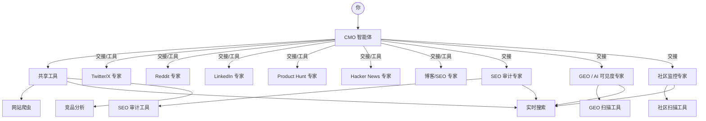

<div align="center">
  
</div>

<h1 align="center">OpenCMO</h1>

<div align="center">
  <strong>开源 AI CMO —— 别人收 $99/月的能力，我们免费给你。</strong>
</div>
<br/>

<div align="center">
  <a href="README.md">🇺🇸 English</a> | 🇨🇳 中文
</div>

<div align="center">
  <a href="https://www.python.org/downloads/"></a>
  <a href="LICENSE"></a>
  <a href="https://github.com/study8677/OpenCMO/stargazers"></a>
</div>

---

> **Okara 收费 $99/月，我们收费 $0。** 而且覆盖更多平台。

## 什么是 OpenCMO？

OpenCMO 是一个多智能体 AI 系统，充当你的完整营销团队。给它一个 URL，它就会爬取网站、提炼卖点，为 **9 个渠道** 生成即发即用的营销内容 —— 通过一个简洁的命令行界面。

专为**独立开发者和小团队**打造 —— 你只管写代码，营销的事交给它。

## 为什么选 OpenCMO？

| 能力 | Okara ($99/月) | OpenCMO (免费) |
|---|:---:|:---:|
| Twitter/X 内容生成 | 有 | 有 |
| Reddit 帖子 | 仅生成 | 生成 + 监控 |
| LinkedIn 帖子 | 计划中 | 有 |
| Product Hunt 发布文案 | 无 | 有 |
| Hacker News 帖子 | 仅监控 | 生成 + 监控 |
| 博客/SEO 文章 | 无 | 有 |
| 实时搜索（趋势/竞品） | 有 | 有 |
| SEO 审计 | 有 | 有 |
| GEO 评分（AI 可见度） | 有 | 有 |
| 社区监控（Reddit + HN） | 有 | 有 |
| 竞品分析 | 有 | 有 |
| 一键全渠道生成 | 无 | 有 |
| 开源 | 否 | 是 |
| **覆盖平台数** | **3** | **9** |

## 功能特性

### 9 大平台专家
- **Twitter/X** —— 多种推文变体 + 话题线程，精心设计开头钩子
- **Reddit** —— 真实、有故事感的帖子，适配 r/SideProject 等社区
- **LinkedIn** —— 专业但不无聊的数据驱动型帖子
- **Product Hunt** —— 标语、描述、创作者首评一站搞定
- **Hacker News** —— 低调务实的技术向 Show HN 帖子
- **博客/SEO** —— 为 Medium / Dev.to 生成 SEO 友好的文章大纲

### 营销情报
- **SEO 审计** —— 单页技术审计：标题、Meta、OG 标签、标题层级、图片 Alt、链接 —— 每个问题附带可直接复制的修复代码
- **GEO 评分** —— AI 搜索可见度分析，覆盖 Perplexity 和 You.com（0-100 评分）
- **竞品分析** —— 结构化情报：功能、定价、定位、差异化机会
- **社区监控** —— 扫描 Reddit + HN 讨论，发现高价值帖子，生成真诚的回复建议（不自动发布）
- **实时搜索** —— 竞品研究、市场趋势、关键词发现

### 智能编排
- **单平台** → 交接给专家，深度互动式创作
- **全渠道** → CMO 以工具模式调用所有专家，汇总输出完整营销方案
- **上下文感知** —— 保持对话历史，自动截断防止 token 溢出

## 架构



## 快速开始

### 1. 安装

```bash
pip install -e .
crawl4ai-setup
```

### 2. 配置

```bash
cp .env.example .env
# 填入你的 OpenAI API Key
```

### 3. 运行

```bash
opencmo
```

## 使用示例

```text
You: 帮我为 https://crawl4ai.com/ 做一个全平台推广方案

CMO 正在思考...

[CMO Agent]
以下是 Crawl4AI 的全渠道营销方案：

## Twitter/X
1. "别再从零写爬虫了。一行 Python → 任意 URL 的 LLM-ready Markdown..."
...

## Reddit (r/SideProject)
"我做了一个开源爬虫，输出 LLM 可直接使用的 Markdown..."
...

## LinkedIn / Product Hunt / Hacker News / 博客
...
```

```text
You: 审计一下 https://myproduct.com 的 SEO

[SEO 审计专家]
# SEO 审计报告
[CRITICAL] Meta Description: 缺失
  修复: <meta name="description" content="...">
[WARNING] H1: 发现多个 H1 标签 (3个)
...
```

```text
You: 查一下 Crawl4AI 在 AI 搜索引擎里的 GEO 评分

[AI 可见度专家]
# GEO 评分: 62/100
| 可见度   | 30 | 40 |
| 位置     | 17 | 30 |
| 情感倾向 | 15 | 30 |
...
```

```text
You: 看看 Reddit 和 HN 上有没有人讨论 Crawl4AI

[社区监控专家]
## Hacker News: 发现 4 条讨论
- "Show HN: Crawl4AI — 开源 LLM 友好爬虫" — 142 点赞
  建议回复: ...
## Reddit: 2 条相关帖子
...
```

## 路线图

- [x] 9 大平台专家 + 全渠道编排
- [x] SEO 审计 + 可执行修复建议
- [x] GEO 评分（AI 搜索可见度）
- [x] 社区监控（Reddit + HN）
- [x] 竞品分析
- [x] 实时搜索集成
- [ ] Web UI + 实时流式输出
- [ ] 通过平台 API 自动发布
- [ ] GEO 评分时间序列追踪（SQLite 持久化）
- [ ] 全站 SEO 审计（基于 Sitemap）
- [ ] 内容日历与定时发布
- [ ] 自定义品牌语调训练

## 参与贡献

欢迎贡献！Fork → 开分支 → 提 PR。

**贡献方向：**
- 新平台专家（YouTube、Instagram、TikTok）
- 优化现有专家的提示词
- Web UI 前端
- 自动发布集成

## 许可证

Apache License 2.0 —— 详见 [LICENSE](LICENSE)。

---

<div align="center">
  如果 OpenCMO 对你有帮助，顺手给个 <strong>Star ⭐</strong> 就是最大的支持！
</div>
