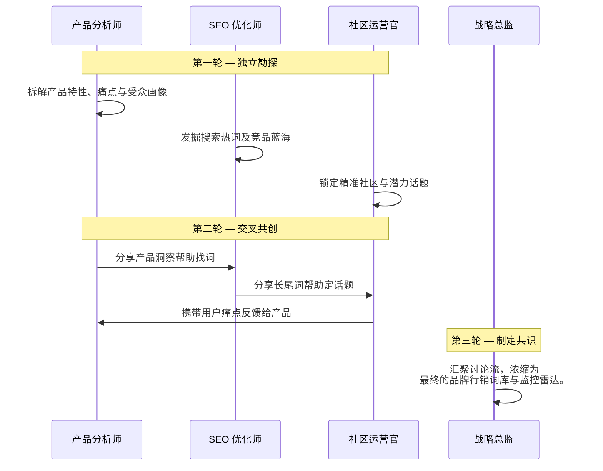

<div align="center">
  
</div>

<h1 align="center">OpenCMO</h1>

<p align="center">
  <strong>开源 AI 首席营销官 (CMO) —— 一个工具，你的整个营销团队。</strong><br/>
  <sub>强大的多智能体系统，内置 25+ 位专业 AI 专家，提供持续运行的 SEO/GEO/SERP/社区监控、保存精确发布 payload 的审批流，以及带交互式 3D 知识图谱的现代化 Web 仪表盘。</sub>
</p>

<div align="center">
  <a href="README.md">English</a> | <a href="README_zh.md">中文</a> | <a href="README_ja.md">日本語</a> | <a href="README_ko.md">한국어</a> | <a href="README_es.md">Español</a>
</div>

<p align="center">
  <a href="https://www.python.org/downloads/"></a>
  <a href="LICENSE"></a>
  <a href="https://github.com/study8677/OpenCMO/stargazers"></a>
  
</p>

---

## OpenCMO 是什么？

OpenCMO 是一个专为独立开发者、初创公司和小团队设计的 **多智能体 AI 营销生态系统**。只需输入您的产品链接，OpenCMO 将会：

1. **深度解析您的网站**，理解您的产品定位和目标受众。
2. **策动多智能体策略辩论**，精准提炼最佳关键词、定位以及目标社区。
3. **自动化持续监控**，覆盖 SEO、AI 搜索可见度 (GEO)、SERP 关键词排名以及开发者社区 (Reddit, Hacker News, Dev.to)。
4. **生成 20+ 平台的专属内容**，在审批队列中审核精确发布 payload，并在您明确放行时自动发布到 Reddit 和 Twitter。

---

## OpenCMO 的差异化价值

- **它把生成式营销与可观测增长信号真正耦合起来** —— 内容智能体、SEO/GEO/SERP/社区监控，以及 3D 图谱运行在同一个操作平面，不再是割裂的几套工具。
- **调度器现在直接运行在 Web 生命周期内** —— 只要 `opencmo-web` 在线，已保存的 cron 监控就会持续生效，不需要再靠额外 CLI 保活。
- **审批流保存的是“精确待发布 payload”** —— 被审核的内容，就是最终会执行的内容，而不是一次性预览文本。
- **依然坚持 BYOK 与可扩展** —— 存储层、API、调度器策略和 React SPA 都保持可读、可改、可二次开发。

---

## 界面与交互体验

采用毛玻璃质感设计的现代化 React 单页面应用 (SPA)，让您以最直观的方式掌控全局。

<div align="center">
  
  <p><i>实时项目仪表盘 — 一目了然地追踪 SEO、GEO (AI 可见度)、SERP 排名以及社区互动。</i></p>
</div>

<div align="center">
  <h3>
    <a href="https://www.bilibili.com/video/BV1T5AMzoEKV/">
      ▶ 在 Bilibili 观看完整演示视频
    </a>
  </h3>
  <sub>10 分钟全功能演示：SEO 审计、GEO 检测、SERP 追踪、知识图谱、多智能体对话等。</sub>
</div>

---

## 交互式知识图谱

**知识图谱**是您市场情报的核心 —— 一个交互式 3D 力导向网络，将整个营销生态系统可视化呈现。

<div align="center">
  
  <p><i>品牌、关键词、社区讨论、竞品及 SERP 排名的 3D 力导向动态地图。</i></p>
</div>

**核心能力：**
- **主动图谱扩张** — 点击「开始探索」，图谱将自动一波一波地发现新竞品、关键词和关联关系。随时可暂停和继续。
- **BFS 深度拓扑** — 发现的节点链接到其父节点（不是扁平化到品牌），保留探索树结构。越深的节点越小、越透明。
- **前沿可视化** — 未探索的节点以紫色线框圆环高亮显示，展示图谱可以继续扩展的方向。
- **交互式探索** — 自由缩放、拖拽和漫游您的数字品牌宇宙。
- **6 大维度节点** — 品牌 (紫色)、关键词 (青色)、社区讨论 (琥珀色)、搜索排名 (绿色)、竞品 (红色)、重叠关键词 (橙色)。
- **竞品情报网络** — 添加竞品 URL，立刻在图谱中高亮显示竞争交锋地带（红色虚线动态连接）。
- **实时同步** — 图谱每 30 秒刷新（主动扩展期间加速到 5 秒）。
- **AI 驱动的竞品发现** — 自动识别竞品并追踪重叠关键词。

---

## 功能亮点

### SEO 审计

基于 Google PageSpeed Insights API，持续审计性能分数、Core Web Vitals（LCP、CLS、TBT）、Schema.org、robots.txt 和站点地图。新增 **AI 爬虫检测**（检查 robots.txt 中 14 种 AI 爬虫 — GPTBot、ClaudeBot、PerplexityBot、Google-Extended 等）和 **llms.txt** 验证与生成（引导 AI 爬虫的新兴标准）。

<div align="center">
  
  <p><i>性能趋势图表与 Core Web Vitals 详细分析。</i></p>
</div>

### GEO 检测（AI 搜索可见度）

监控品牌在 AI 搜索引擎中的可见度：Perplexity、You.com、ChatGPT、Claude 和 Gemini。新增 **可引用性评分**（5 维度 AI 引用就绪度分析）、**品牌数字足迹**扫描（YouTube、Reddit、Wikipedia、Wikidata、LinkedIn 存在度及相关性加权评分）和 **AI 爬虫访问**检测（14 种爬虫，包括 GPTBot、ClaudeBot、PerplexityBot）。

<div align="center">
  
  <p><i>AI 搜索平台品牌可见度评分趋势。</i></p>
</div>

### SERP 追踪

持续追踪目标关键词的搜索排名位置。支持网页爬取或 DataForSEO API。

<div align="center">
  
  <p><i>关键词排名一览表与排名历史趋势图。</i></p>
</div>

### 社区监控

自动扫描 **Reddit、Hacker News、Dev.to、YouTube、Bluesky、Twitter/X** 上的品牌提及与相关讨论。支持多信号评分（互动速度、文本相关性、时效衰减、跨平台收敛检测），实现跨平台可比排名。

<div align="center">
  
  <p><i>跨平台扫描历史与追踪中的讨论。</i></p>
</div>

### 趋势研究

**趋势研究 Agent** 可跨社区平台研究任意话题，支持查询扩展、对比模式（"X vs Y"）和时间窗口过滤，结果经多信号评分后生成可操作的趋势简报。

### 主动洞察

OpenCMO 不等你来查——**有事主动告诉你**。7 个纯规则检测器（零 LLM 成本）持续监控 SERP 排名下降、GEO 分数下降、高热度社区讨论、SEO 性能退化、竞品关键词差距、**可引用性评分回退**和 **AI 爬虫封锁**。洞察以通知铃铛徽章和 Dashboard 顶部优先横幅展示，每条都带可操作的 CTA 按钮（查看详情、生成内容、添加关键词）。

### 图谱智能

知识图谱不再只是可视化工具——它现在是**主动智能层**。图谱数据（竞品关系、关键词缺口、SERP 排名）自动注入聊天上下文和研究简报，CMO Agent 可随时调用 `get_competitive_landscape` 查询完整竞争格局。系统中任何地方新增的关键词和竞品都会自动进入图谱扩展队列。

现在聊天也支持**项目级范围**。每个项目页面都有“**讨论这个项目**”入口，点击后会带着 `project_id` 进入 Chat；Chat 顶部会显示当前讨论的是哪个项目，历史会话也会保留项目绑定。注入到聊天里的上下文来自 `build_project_context()` 生成的已保存知识图谱和监控摘要，适合竞品、关键词、SERP、GEO 与差距分析，但不会自动同步你当前页面上临时看到的卡片状态。

### 审批流与定时运行

在 SPA 中审核精确发布 payload，批准或拒绝时留下可追踪记录，同时让 Web 进程持续维持定时监控。真实发布依然严格遵守 `OPENCMO_AUTO_PUBLISH=1`，审批不会绕过最后一道安全阀。

现在高信号洞察还可以进入 **Autopilot 草稿** 流程。启用后，OpenCMO 会先快照动作前指标，再调用映射专家生成草稿，并把 `why_this`、`why_now`、`why_here` 解释信息以及触发它的 insight 关联一起写入审批记录。真正发布前仍然保留人工审核。

---

## 你的专属 AI 营销团队

OpenCMO 内部搭载了 **25+ 位各司其职的 AI 专家**，分为三大阵营：

### 市场洞察智能体

| 专家角色 | 核心职责 |
| :--- | :--- |
| **CMO 首席营销官** | 整个团队的大脑。接收请求并自动路由分配给最合适的专家。 |
| **SEO 审计师** | 通过 Google PageSpeed API 审查核心网页指标、Schema.org、robots.txt 及网站地图。 |
| **GEO 能见度专家** | 监控品牌在 Perplexity、You.com、ChatGPT、Claude、Gemini 中的被提及率。 |
| **社区雷达** | 实时扫描 Reddit、HN、Dev.to，发现品牌提及和高价值讨论。 |

### 内容创作智能体（国际平台）

| 专家角色 | 目标平台 |
| :--- | :--- |
| **Twitter/X 专家** | 推文、Hook 和帖子串 |
| **Reddit 战略家** | 原生态帖子和智能回复 |
| **LinkedIn 职场专家** | 专业思想领袖文章 |
| **Product Hunt 专家** | Slogan、描述和 Maker 评论 |
| **Hacker News 极客** | 硬核 "Show HN" 技术贴 |
| **Blog/SEO 写手** | 长篇 SEO 优化博文 (2000 词+) |
| **Dev.to 专家** | 开发者社区文章 |

### 内容创作智能体（中文平台）

| 专家角色 | 目标平台 |
| :--- | :--- |
| **知乎专家** | 知乎问答 |
| **小红书专家** | 小红书种草笔记 |
| **V2EX 专家** | V2EX 开发者论坛 |
| **掘金专家** | 掘金技术社区 |
| **即刻专家** | 即刻社交平台 |
| **微信专家** | 微信公众号生态 |
| **开源中国专家** | OSChina 开源社区 |
| **GitCode 专家** | GitCode 开源平台 |
| **少数派专家** | SSPAI 效率工具 |
| **InfoQ 专家** | InfoQ 中国技术媒体 |
| **阮一峰周刊专家** | 阮一峰科技爱好者周刊投稿格式 |

---

## 平台接入总览

所有接入均可通过 Web 仪表盘的**设置面板**直接配置 —— 无需手动编辑 `.env` 文件。

<div align="center">
  
  <p><i>统一设置面板 — 在 Web UI 中配置所有 API 密钥和平台接入。</i></p>
</div>

### 监控与分析（自动化）

| 能力 | 平台 | 方式 |
| :--- | :--- | :--- |
| **社区监控** | Reddit, Hacker News, Dev.to | 公开 API（无需认证） |
| **GEO 检测** | Perplexity, You.com | 网页爬取（无需认证） |
| **GEO 检测** | ChatGPT, Claude, Gemini | API 调用（在设置中配置密钥） |
| **SEO 审计** | Google PageSpeed Insights | HTTP API（可选密钥提升限额） |
| **SERP 追踪** | Google, DataForSEO | 网页爬取或 DataForSEO API |

### 自动发布（用户可控）

| 平台 | 方式 | 配置 |
| :--- | :--- | :--- |
| **Reddit** | PRAW（发帖 + 回复） | 在设置中配置 Reddit 应用凭证 |
| **Twitter/X** | Tweepy（发推） | 在设置中配置 Twitter API 凭证 |

### 报告

| 功能 | 方式 | 配置 |
| :--- | :--- | :--- |
| **邮件报告** | SMTP | 在设置中配置 SMTP 凭证 |

> 其他所有智能体（LinkedIn、Product Hunt、中文平台等）生成即用型内容，您复制粘贴到目标平台即可。

---

## 核心机制：多智能体联合辩论

当您提交一个 URL，OpenCMO 会让不同角色的专家进行 **3 轮交叉协作讨论**：



通过让 AI 互相读取、启发和纠偏，OpenCMO 能产出比单次对话丰富、立体得多的战略方案。

<div align="center">
  
  <p><i>多智能体分析讨论 — 多位专业智能体实时协作辩论。</i></p>
</div>

---

## AI 对话界面

直接与 25+ 位专业智能体对话。CMO 智能体自动将请求路由到最合适的专家。通过 SSE 流式传输实现实时响应。

- **项目级对话** —— 可从任意项目页面一键进入带项目上下文的 Chat。
- **持久化项目范围** —— Chat 会显示当前项目，并将项目绑定保存到每条会话里，回看历史时会自动恢复。
- **图谱摘要注入** —— 聊天上下文来自已保存的项目情报摘要，而不是当前页面的瞬时视图。

<div align="center">
  
  <p><i>专家选择网格与流式对话 — 随时随地接入营销专家。</i></p>
</div>

---

## 极速启动指南

OpenCMO 兼容所有 OpenAI 协议 API，您享有绝对的底层控制权（支持 **OpenAI, DeepSeek, 阿里云, Kimi, Ollama** 等）。

### 1. 本地安装

```bash
git clone https://github.com/study8677/OpenCMO.git
cd OpenCMO

# 安装全部依赖包
pip install -e ".[all]"

# 初始化爬虫引擎配置
crawl4ai-setup
```

### 2. 参数配置

```bash
cp .env.example .env
```
编辑 `.env` 填入您的模型密钥。*以 DeepSeek 为例：*
```env
OPENAI_API_KEY=sk-您的APIKey
OPENAI_BASE_URL=https://api.deepseek.com/v1
OPENCMO_MODEL_DEFAULT=deepseek-chat
TAVILY_API_KEY=tvly-您的TavilyKey
```

> **提示：** 启动后也可以直接在 Web 仪表盘的**设置**面板中配置所有 API 密钥，无需再手动编辑 `.env`。

> 当配置了 `TAVILY_API_KEY` 时，OpenCMO 会优先用 Tavily 处理通用 URL 分析和共享网页内容获取；只有 Tavily 不可用或没有返回可用内容时，才会回退到原有的抓取逻辑。依赖真实 HTML 结构的审计和特定平台抓取仍保留原有专用路径。

### 3. 启动仪表盘

```bash
opencmo-web
```
浏览器打开 [http://localhost:8080/app](http://localhost:8080/app)。

> *偏好命令行？直接运行 `opencmo` 即可开启终端沉浸式交互模式。*

### 4. 前端开发（可选）

```bash
cd frontend
npm install
npm run dev     # 开发服务器 localhost:5173（自动代理 API 到 :8080）
npm run build   # 生产构建
```

---

## 路线图

- [x] **25+ AI 营销专家**，含智能路由对话
- [x] **多智能体 URL 分析**，通过协作辩论
- [x] **React SPA**，支持多语言 (中/英)
- [x] **API 不绑定** — OpenAI、Anthropic、DeepSeek、NVIDIA、Ollama
- [x] **交互式 3D 知识图谱**，支持主动 BFS 扩张和竞品情报
- [x] **社区监控** — Reddit, Hacker News, Dev.to, YouTube, Bluesky, Twitter/X
- [x] **GEO 检测** — Perplexity, You.com, ChatGPT, Claude, Gemini
- [x] **SEO 审计** — 核心 Web 指标、Schema.org、robots.txt
- [x] **SERP 追踪** — 关键词排名监控
- [x] **审批流 + 定时监控运行时** — 精确 payload 审核与 Web 生命周期 cron 执行
- [x] **自动发布** — Reddit（发帖 + 回复）和 Twitter
- [x] **邮件报告** — SMTP 发送
- [x] **AI 驱动竞品发现**与关键词重叠分析
- [x] **多信号社区评分** — 互动速度、文本相关性、时效衰减、跨平台收敛检测
- [x] **趋势研究 Agent** — 跨平台话题探索、查询扩展、对比模式
- [x] **图谱智能管线** — 知识图谱反馈到 agent 决策、聊天上下文、内容简报
- [x] **主动洞察引擎** — SERP 下降/GEO 下降/社区高热/SEO 退化/竞品差距检测 + 可操作 CTA
- [x] **统一设置面板** — 在 Web UI 中配置所有 API 密钥
- [x] **GEO 优化工具包** — 可引用性评分（5 维度 AI 引用就绪度）、AI 爬虫检测（14 种爬虫）、品牌数字足迹扫描（YouTube/Reddit/Wikipedia/LinkedIn）、llms.txt 验证与生成。灵感源自 [geo-seo-claude](https://github.com/zubair-trabzada/geo-seo-claude)
- [ ] 直接发布到 LinkedIn、Product Hunt 等更多平台
- [ ] 自定义品牌声音微调
- [ ] 企业级全站 SEO 深度爬取

---

## 贡献者

- [study8677](https://github.com/study8677) - OpenCMO 的创建者与维护者
- [ParakhJaggi](https://github.com/ParakhJaggi) - 通过 [#2](https://github.com/study8677/OpenCMO/pull/2) 和 [#3](https://github.com/study8677/OpenCMO/pull/3) 提交 Tavily 集成相关贡献
- 查看 [CONTRIBUTORS.md](CONTRIBUTORS.md) 获取维护中的贡献者名录
- 查看 [CONTRIBUTING.md](CONTRIBUTING.md) 获取贡献流程、PR 要求与署名说明

> GitHub 默认的 Contributors 图谱依赖 commit author 邮箱和 GitHub 账号的映射关系。如果合并进主分支的提交使用了未绑定到该账号的邮箱，默认图谱里可能不会显示该贡献者，但这并不影响其真实贡献事实。

---

## 致谢

- [geo-seo-claude](https://github.com/zubair-trabzada/geo-seo-claude) by [@zubair-trabzada](https://github.com/zubair-trabzada) — 一个面向 Claude Code 的综合性 GEO（生成式引擎优化）审计工具包。OpenCMO 的 GEO 模块从其可引用性评分框架、AI 爬虫检测方案（14+ 种爬虫，包括 GPTBot、ClaudeBot、PerplexityBot）、平台专属优化矩阵（Google AIO、ChatGPT、Perplexity、Gemini、Bing Copilot 各有独立策略）以及 E-E-A-T 评估方法论中汲取了灵感。
- [last30days-skill](https://github.com/mvanhorn/last30days-skill) by [@mvanhorn](https://github.com/mvanhorn) — OpenCMO 的多信号评分系统、跨平台收敛检测和趋势研究工具的设计灵感来源于 last30days 的多平台社区研究和质量排序方案。

---

<p align="center">
  由开源社区倾情打造 <br/>
  <b>如果 OpenCMO 帮您节省了时间，请在 GitHub 给我们一颗 Star！</b>
</p>
